# KaushalSetu — Technical Architecture Specification

| | |
|---|---|
| **File** | `docs/04-architecture.md` |
| **Audience** | The whole team (6). Every developer should read §0, §1 and the sections for their area. |
| **Status** | Draft v0.1, for team review. **No implementation yet.** |
| **Implements** | [`03-prd.md`](03-prd.md). Feature IDs (F1–F19), requirement IDs (FR-*, NFR-*, SEC-*, EXP-*, AIQ-*), screen IDs (SCR-*) and scoring rules (PRD §7) are referenced, not repeated. |
| **Related** | [`01-domain.md`](01-domain.md), [`DATA_SOURCE_INVENTORY.md`](DATA_SOURCE_INVENTORY.md), [`DATA_COLLECTION_PLAN.md`](DATA_COLLECTION_PLAN.md) |

> Diagrams use **Mermaid**. They render on GitHub, and in VS Code with a Mermaid preview extension.
> Library versions are not fixed here. **Pin exact versions in lockfiles** during setup (see §14.6).

---

## Contents
0. [Architecture principles and key decisions](#0-architecture-principles-and-key-decisions)
1. [High-level architecture](#1-high-level-architecture)
2. [Backend architecture](#2-backend-architecture)
3. [Database architecture](#3-database-architecture)
4. [AI/NLP architecture](#4-ainlp-architecture)
5. [Data pipeline architecture](#5-data-pipeline-architecture)
6. [Frontend architecture](#6-frontend-architecture)
7. [API architecture](#7-api-architecture)
8. [Authentication and RBAC architecture](#8-authentication-and-rbac-architecture)
9. [Evidence and provenance architecture](#9-evidence-and-provenance-architecture)
10. [Explainability architecture](#10-explainability-architecture)
11. [Privacy and security architecture](#11-privacy-and-security-architecture)
12. [Synthetic-data architecture](#12-synthetic-data-architecture)
13. [Offline-demo architecture](#13-offline-demo-architecture)
14. [Deployment architecture](#14-deployment-architecture)
15. [Failure and fallback architecture](#15-failure-and-fallback-architecture)
16. [Quick answers to key questions](#16-quick-answers-to-key-questions)
17. [Open decisions and TODO-VERIFY](#17-open-decisions-and-todo-verify)
- [Appendix A: Repository layout](#appendix-a-repository-layout)
- [Appendix B: Environment variables](#appendix-b-environment-variables)

---

## 0. Architecture principles and key decisions

### 0.1 Principles
1. **Boring and small beats clever.** One backend codebase, one database, and a batch pipeline. A student team must be able to understand every box.
2. **Deterministic core, optional AI.** Every score, flag and recommendation comes from **explicit rules** (PRD §7). AI helps with *text* (matching, drafting, phrasing). It never produces numbers (AIQ-3).
3. **Evidence is data, not decoration.** Evidence and provenance are stored as first-class records, produced by the same code that computes the scores (§9).
4. **Offline-first demo.** The golden path needs no internet connection (§13).
5. **Everything reproducible.** Seeded synthetic data, versioned configuration, pipeline runs with IDs, and a one-click reset.
6. **Fail soft.** Every optional component (LLM, embeddings, bot, map tiles) has a fallback, so the product keeps working without it (§15).

### 0.2 Key decisions (Architecture Decision Record summary)
| ID | Decision | Alternatives considered | Why |
|---|---|---|---|
| ADR-01 | **Modular monolith**: one FastAPI app + one worker process from the same codebase | Microservices | Fewer moving parts; one deployment; team size of 6 |
| ADR-02 | **PostgreSQL + pgvector as the only data store** | Postgres + Neo4j; Postgres + a separate vector DB | Our graph is small and shallow; vectors are few (§3.9, §3.10) |
| ADR-03 | **Batch analytics pipeline** with results stored per **pipeline run**, then atomically switched to "current" | Real-time or streaming computation | Demand changes quarterly; batch is simpler, testable and explainable |
| ADR-04 | **DB-backed job queue** (a `job` table polled by the worker) | Celery + Redis; FastAPI BackgroundTasks only | No extra services; survives API restarts; job status is visible |
| ADR-05 | **Sync SQLAlchemy 2** with sync FastAPI endpoints (run in a thread pool) | Async SQLAlchemy | Simpler for beginners; our load is tiny |
| ADR-06 | **Rule-first NLP**: aliases → fuzzy → embeddings (optional) → LLM (optional) | LLM-first extraction | ₹0 budget; deterministic; testable; offline |
| ADR-07 | **Pluggable LLM client**, default provider `none`, with a DB response cache and a cache-only mode | Hard dependency on one provider | Cost, reliability, offline demo |
| ADR-08 | **Config as versioned YAML** (`config/scoring.yaml`), snapshotted into the DB for every run | Constants in code | Tunable, auditable, explainable (FR-X.5) |
| ADR-09 | **SPA (React + Vite) served as static files by nginx**, which also proxies `/api` | Server-side rendering | Simple hosting; offline; one origin (no CORS in demo) |
| ADR-10 | **Map without online tiles by default** (district shapes only) | OpenStreetMap tiles | Works offline; tiles are optional when online |
| ADR-11 | **PDF with Jinja2 + WeasyPrint inside the Linux container**, with bundled fonts | Browser print; other PDF libraries | Good HTML/CSS layout; Devanagari font control; avoids Windows native-library issues |
| ADR-12 | **Demo reset = restore a database snapshot** (`pg_restore`) | Re-running all loaders | Exact, fast (≤ 60 s), reliable (FR-18.1) |

### 0.3 Small additions to the requested stack (justified)
| Addition | Where | Why |
|---|---|---|
| React Router (or TanStack Router) | Frontend | Routing and role-based route guards. Required; not in the original list. |
| `openapi-typescript` (type generator) | Frontend build | Generates TypeScript types from FastAPI's OpenAPI schema, so frontend and backend never drift apart |
| react-hook-form + zod (optional) | Frontend forms | Standard pairing with shadcn/ui forms; validation for the survey and wizard |
| pydantic-settings | Backend | Typed configuration from environment variables |
| Typer (or argparse) | Backend CLI | Admin commands: load, reset, pipeline, eval, snapshot |
| PyJWT + argon2-cffi (or passlib[bcrypt]) | Backend auth | JWT tokens and password hashing |
| psycopg (v3) + pgvector-python | Backend DB | Postgres driver + vector type support in SQLAlchemy |
| python-telegram-bot | Bot | Telegram adapter (polling mode locally, webhook when hosted) |
| nginx | Deployment | Serves the SPA and proxies the API |

---

## 1. High-level architecture

### 1.1 Logical flow (the KaushalSetu loop as software)

```mermaid
flowchart LR
    subgraph Sources["Data sources"]
        S1["Curated real data<br/>(syllabi, QPs, districts)"]
        S2["Job postings<br/>(real sample + synthetic)"]
        S3["Employer survey<br/>(web / Telegram)"]
        S4["Sector events<br/>(real + simulated)"]
        S5["Outcomes<br/>(synthetic)"]
    end
    Sources --> ING["Ingestion<br/>+ validation"]
    ING --> PROV["Provenance<br/>stamping"]
    PROV --> NLP["NLP / skill<br/>normalisation"]
    NLP --> DB[("PostgreSQL<br/>+ pgvector")]
    DB --> DEM["Demand engine"]
    DB --> SUP["Supply engine"]
    DEM --> MIS["Mismatch engine"]
    SUP --> MIS
    DEM --> TRD["Trend / forecast engine"]
    MIS --> HLT["Course health"]
    TRD --> HLT
    HLT --> CUR["Curriculum alignment<br/>+ resource planning"]
    CUR --> REC["Recommendations<br/>+ evidence"]
    REC --> VAL["Employer validation<br/>+ pledges"]
    VAL --> PLAN["District plan (PDF)"]
    REC --> CAND["Candidate guidance"]
    HLT --> CAND
    PLAN -.-> OUT["Outcomes feed back<br/>(next run)"]
    OUT -.-> DB
```

### 1.2 Runtime containers

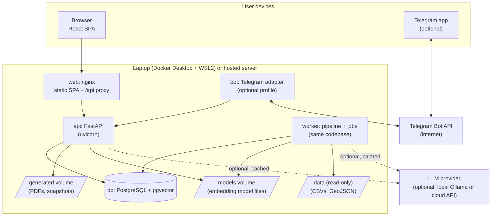

### 1.3 Components and responsibilities
| Component | Responsibility | Key PRD features |
|---|---|---|
| **web (nginx + SPA)** | Serves the React app; proxies `/api` to the API; serves static GeoJSON and fonts | All screens |
| **api (FastAPI)** | REST API, auth/RBAC, reads the current pipeline results, records votes/pledges/surveys, generates PDFs, enqueues jobs | F11–F19, FR-X |
| **worker** | Runs jobs: data load, NLP extraction, analytics pipeline, snapshot/reset | F1–F11, F19 |
| **db (Postgres + pgvector)** | Single source of truth: reference data, facts, derived results, evidence, engagement, ops | All |
| **bot (optional)** | Telegram dialogs for the employer survey (P1) and candidate Q&A (P1); calls the same API services | F12 (P1), F15 (P1) |
| **LLM provider (optional)** | Structured text tasks only (§4.6). Never required. | AI-1…AI-6 |

---

## 2. Backend architecture

### 2.1 Style: layered modular monolith

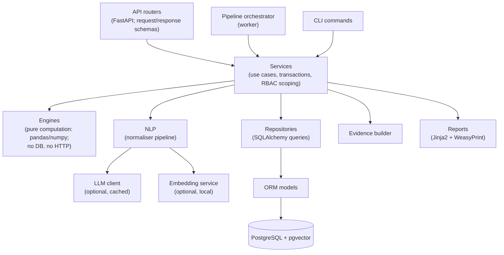

**Layer rules (enforced in code review):**
| Layer | May call | Must not |
|---|---|---|
| Routers | Services | Contain business logic or SQL |
| Services | Engines, repositories, NLP, evidence, reports | Contain formulas (these belong in engines) |
| Engines | Only plain Python / pandas / numpy | Touch the DB, HTTP or files. **This keeps them unit-testable with hand-calculated fixtures (NFR-13).** |
| Repositories | ORM models | Apply business rules (apart from RBAC scope filters passed in) |

### 2.2 Backend package layout
```
backend/app/
  main.py                 # app factory, router registration
  core/                   # settings, security (JWT, hashing), logging, errors, i18n keys
  api/v1/                 # routers: auth, reference, analytics, courses, recommendations,
                          #          employer, public (survey, guidance, about), plans, admin, webhooks
  schemas/                # Pydantic request/response models (source of the OpenAPI contract)
  services/               # one service per feature area (e.g. RecommendationService)
  engines/                # demand, supply, mismatch, trends, forecast, coverage, health,
                          # curriculum, resources, recommendations, ranking, confidence
  nlp/                    # text cleaning, alias matcher, fuzzy matcher, embedding matcher,
                          # llm extractor, level rules, role classifier, evaluator
  llm/                    # LLMClient interface, providers (none, mock, ollama, openai, anthropic),
                          # cache, prompt templates (versioned), output schemas, PII scrubber
  evidence/               # EvidenceBuilder, evidence types, summary templates (i18n keys)
  pipeline/               # orchestrator, steps, job worker, run manager (atomic swap)
  ingest/                 # CSV loaders, validators, provenance stamping, dedupe, district mapping
  reports/                # plan assembler, Jinja2 templates, WeasyPrint renderer, fonts config
  bots/                   # dialog engine (shared), telegram adapter, (optional) whatsapp adapter
  models/                 # SQLAlchemy ORM models grouped by domain
  repositories/           # query objects grouped by domain
  cli/                    # load-demo, reset-demo, snapshot, run-pipeline, eval-nlp, embed-skills,
                          # generate-synthetic, check-data
synthgen/                 # synthetic data generator (separate package; writes CSVs only)
config/                   # scoring.yaml, sectors.yaml (staffing pattern), llm.yaml, demo.yaml
```

### 2.3 Request lifecycle
1. nginx receives `/api/v1/...` and proxies it to uvicorn.
2. Middleware assigns a **request ID** and starts a timer. The logs never contain request bodies.
3. The router validates input with a Pydantic schema, then resolves the dependencies: `db_session`, `current_user` (if not public) and `require_roles(...)`.
4. The service applies the **scope filter** (e.g. institute admin → own institute), calls repositories and engines, and builds the response DTO, including `meta` (run ID, config version, computed-at).
5. Errors are converted into the standard error shape (§7.4).
6. State-changing calls write an **audit log** entry in the same transaction (SEC-5).

### 2.4 Configuration
| Kind | Where | Examples |
|---|---|---|
| **Runtime settings** (per environment) | Environment variables → `pydantic-settings` | `DATABASE_URL`, `JWT_SECRET`, `DEMO_MODE`, `LLM_PROVIDER`, `EMBEDDINGS_ENABLED` (Appendix B) |
| **Scoring configuration** (product logic) | `config/scoring.yaml` → validated by a Pydantic model → stored as a `scoring_config_version` row (with its hash) | Weights, thresholds, coverage factor, completion rate, realisation factor, lag window, N approvals |
| **Sector assumptions** | `config/sectors.yaml` | Staffing pattern (role shares) per sector event type. **Labelled as assumptions.** |
| **LLM tasks** | `config/llm.yaml` | Per-task on/off, prompt version, timeout, max calls per run |
| **Demo** | `config/demo.yaml` | Demo accounts, pre-seeded votes, golden-path entity IDs |

### 2.5 Jobs and the worker
- **Job table** (`job`): `id, type, params_json, status (QUEUED | RUNNING | SUCCEEDED | FAILED), progress, message, created_by, created_at, started_at, finished_at`.
- The worker polls every 1–2 s and claims a job with `SELECT … FOR UPDATE SKIP LOCKED`. It runs **one job at a time**, which avoids concurrency bugs.
- Job types: `LOAD_DEMO`, `EXTRACT_SKILLS`, `RUN_PIPELINE`, `GENERATE_PLAN` (if a PDF takes > 5 s), `RESET_DEMO`, `SNAPSHOT`.
- The API returns **202 + job ID** for long operations. The UI polls `GET /jobs/{id}` (§7.5).
- **Stale job recovery:** on worker start, any `RUNNING` job older than 10 minutes is marked `FAILED`.

### 2.6 CLI commands (the same services the API uses)
| Command | Purpose |
|---|---|
| `kaushal generate-synthetic --seed N` | Runs `synthgen` → `data/synthetic/*.csv` |
| `kaushal load-demo` | Truncates, loads the reference, curated and synthetic CSVs, extracts skills, runs the pipeline, seeds the demo state |
| `kaushal run-pipeline [--quarter 2026Q3]` | Recomputes all derived results as a new run |
| `kaushal snapshot` | `pg_dump` → `generated/snapshots/demo_baseline.dump` |
| `kaushal reset-demo` | `pg_restore` of the baseline snapshot; clears generated PDFs |
| `kaushal eval-nlp` | Precision/recall/F1 on the gold set (FR-2.6) |
| `kaushal embed-skills` | Computes skill and alias embeddings (offline, once) |
| `kaushal check-data` | Runs data-quality checks DQ-1…DQ-9 |

---

## 3. Database architecture

### 3.1 Logical layers (one PostgreSQL database, `public` schema, table-name conventions)
| Layer | Purpose | Examples | Lifecycle |
|---|---|---|---|
| **Registry** | Where data comes from | `data_source` (loaded from the research inventory CSV) | Rarely changes |
| **Reference / taxonomy** | The Skill Graph and standards | `district`, `place_alias`, `sector`, `job_role`, `role_alias`, `role_skill`, `role_ladder`, `skill`, `skill_alias`, `qualification_pack`, `nos`, `nos_skill`, `course`, `course_module`, `module_skill`, `equipment`, `skill_equipment` | Curated; reloaded with the demo |
| **Facts** | Observed or ingested records | `institute`, `course_offering`, `trainer`, `trainer_skill`, `institute_equipment`, `employer`, `job_posting`, `posting_skill`, `posting_role`, `survey_response`, `survey_skill`, `consultation`, `consultation_insight`, `sector_event`, `sector_indicator`, `candidate`, `enrollment`, `placement_outcome`, `employer_rating` | Appended by ingestion |
| **Derived (per run)** | Engine outputs, keyed by `pipeline_run_id` | `demand_score`, `openings_estimate`, `supply_estimate`, `mismatch`, `district_summary`, `skill_trend`, `forecast`, `course_coverage`, `course_health`, `curriculum_change`, `resource_need`, `recommendation_snapshot`, `evidence` | Recomputed every run; old runs pruned (keep the last 5) |
| **Engagement (persistent)** | Human decisions | `recommendation` (stable identity + status), `validation_vote`, `pledge`, `district_plan`, `plan_item`, `guidance_request_log` (anonymous counts) | Persist across runs |
| **Ops** | Operating the platform | `app_user`, `audit_log`, `job`, `ingestion_run`, `ingestion_error`, `pipeline_run`, `review_item`, `scoring_config_version`, `llm_cache` | — |

### 3.2 Standard columns
| Column group | Columns | Applies to |
|---|---|---|
| Identity & time | `id` (UUID or bigint), `created_at`, `updated_at` | All tables |
| **Provenance** (FR-1.2) | `source_id` (FK → `data_source`), `source_ref`, `fetched_at`, `license_note`, `is_synthetic`, `ingestion_run_id` | Reference and fact tables |
| **Derivation** | `pipeline_run_id`, `config_version`, `synthetic_share` (0–1), `confidence` (HIGH/MEDIUM/LOW), `components_json` | Derived tables |

### 3.3 Core entity–relationship diagram (simplified)

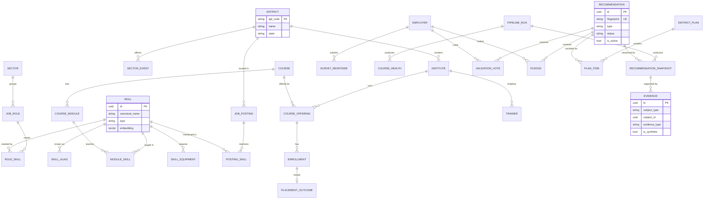

### 3.4 Key table notes
| Table | Important design point |
|---|---|
| `district` | Primary key = the **verified official LGD code** (a string). Until it is verified, use a clearly marked placeholder key, and replace it before the data freeze. |
| `place_alias` | `alias_normalised → district_lgd`. Includes MIDC industrial-area names (inventory S12). |
| `skill` | `embedding vector(384)`: the dimension depends on the chosen model (§4.3). It is nullable, because embeddings are optional. |
| `skill_alias` | `alias`, `alias_normalised`, `language` (en/hi/mr), optional `embedding`. **This is the main matching surface.** |
| `role_skill` | `importance (0–1)`, `required_band (1–4)` |
| `role_ladder` | `from_role_id → to_role_id`, `skills_to_learn` (list), `typical_hours` (optional). Curated (FR-16.2). |
| `module_skill` | `band_taught`, `review_status` |
| `job_posting` | `title`, `description`, `district_lgd`, `posted_at`, `quarter` (derived), `dedupe_key`, provenance. Contact details are **scrubbed** before storage. |
| `posting_skill` | `confidence`, `method (ALIAS/FUZZY/EMBEDDING/LLM/HUMAN)`, `band` |
| `sector_event` | `event_type`, `expected_jobs`, `announced_quarter`, `is_simulated`, `is_synthetic`, citation fields |
| `pipeline_run` | `status`, `is_current` (**only one row is true**), `quarter`, `config_version`, `started_at`, `finished_at`, `step_timings_json` |
| `recommendation` | **Stable identity** across runs: `fingerprint = hash(type, target_type, target_id, skill_id?, district)`, plus `status`, `decision_owner`, `first_run_id`, `last_seen_run_id`, `is_active` |
| `recommendation_snapshot` | Per run: `priority`, `confidence`, `payload_json` (draft module, equipment, ToT), `synthetic_share`. Evidence attaches here. |
| `district_plan` | `content_json` = a **frozen copy** of everything shown in the PDF (numbers, evidence, votes, pledges) at generation time, plus `pipeline_run_id`, `config_version`, `pdf_path` |
| `llm_cache` | `cache_key` (hash of provider + model + task + prompt version + normalised input), `response_json`, `created_at` |
| `guidance_request_log` | Anonymous: `date`, `district`, `education`, `interest`, `language`, `count`. **No identifiers.** |

### 3.5 Why recommendations have two tables
Recommendations are **recomputed every run**, but **human decisions must persist**. Votes, pledges and "added to plan" are attached to the stable `recommendation` row, which is found by its fingerprint. Each run writes a new `recommendation_snapshot` with fresh evidence and priority. If a condition stops being true, the recommendation becomes `is_active = false`: it stays visible in history as "no longer triggered", and is never silently deleted.

### 3.6 Indexes
- Foreign keys on all join columns.
- Derived tables: `(pipeline_run_id, district_lgd, quarter)`, `(pipeline_run_id, role_id)`.
- `job_posting (district_lgd, quarter)`; `posting_skill (skill_id)`; unique `job_posting.dedupe_key`.
- `skill_alias (alias_normalised)`, plus a trigram index if fuzzy search is used in SQL (optional).
- **pgvector:** at our scale (< 10,000 vectors), an exact (sequential) cosine search takes milliseconds. An **HNSW index** with cosine distance is optional, for when the vector count grows.
- `recommendation (fingerprint)` unique; `validation_vote (recommendation_id, employer_id)` unique (FR-13.2).

### 3.7 Migrations and seeding
- **Alembic** owns the schema. One migration per feature branch; never edit an applied migration.
- The **pgvector extension** is enabled in the first migration.
- Seeding happens through loaders (§5.2), **not** migrations, so the data can be reset without touching the schema.
- `kaushal snapshot` creates the **demo baseline** after load + pipeline + pre-seeded votes. `kaushal reset-demo` restores it (ADR-12).

### 3.8 Graph queries without a graph database
| Question | How it is answered in SQL |
|---|---|
| Which skills does role *r* need? | `role_skill` join `skill` (1 hop) |
| What does course *c* teach, at which band? | `course_module` → `module_skill` → `skill` (2 hops) |
| Coverage of role *r* by course *c* | Join the two sets above on `skill_id` (a set comparison, done in pandas) |
| Equipment for a new skill at institute *i* | `skill_equipment` minus `institute_equipment` (2 hops) |
| Who can teach skill *s* at institute *i*? | `trainer` → `trainer_skill` (2 hops) |
| Career path from role *a* | `role_ladder` with a **recursive CTE**, depth ≤ 3 |
| Skills similar to a phrase | pgvector cosine distance on `skill_alias.embedding` / `skill.embedding` |

### 3.9 Why PostgreSQL + pgvector is sufficient
1. **Scale is tiny.** Roughly 10⁴–10⁵ rows in total. Vectors ≈ 300 skills + ~1,500 aliases at 384 dimensions, a few MB. Every query is milliseconds on a laptop.
2. **Our "graph" is shallow and mostly static:** 1–3 hops, covered by joins and a recursive CTE (§3.8).
3. **One system does everything we need:** relations with foreign keys (data integrity, NFR-11), JSONB for components and evidence, window functions for trends, transactions for the atomic run switch, and `pg_dump`/`pg_restore` for the demo reset.
4. **Vectors live next to the data they describe**, with no synchronisation problem between two databases.
5. **First-class tooling:** SQLAlchemy 2, Alembic and pgvector-python are well documented. Free hosted Postgres offerings commonly support pgvector *(TODO-VERIFY the current free tiers; §14.4)*.
6. **One thing to back up, restore, monitor and learn.**

### 3.10 Why we should NOT introduce Neo4j initially
| Concern | Detail |
|---|---|
| No query needs it | No deep traversal, no path-finding over large graphs, no graph algorithms in the MVP |
| Two sources of truth | We would need to keep Neo4j in sync with Postgres (dual writes, drift, no shared transactions) |
| More to learn | A second query language (Cypher), a second driver, a second data model, for a beginner team |
| More to run | An extra container, extra memory (a JVM) on student laptops, more demo-day risk |
| Hosting and cost | Another service to host within a ₹0 budget |
| Reset complexity | The demo reset would need to restore two databases consistently |

**When to reconsider** (after the hackathon): if career paths need multi-hop search over large, dynamic graphs, or graph algorithms (centrality, communities) become product features. The first step would be a Postgres graph extension (e.g. Apache AGE, *TODO-VERIFY hosting support*). The second would be a **read-only** graph replica fed from Postgres, never a second write-master.

---

## 4. AI/NLP architecture

### 4.1 Normalisation pipeline

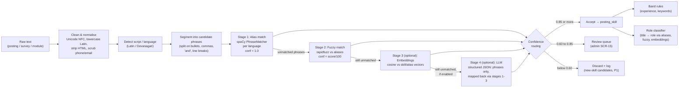

**Key rules:**
- **Stage 4 never creates skills.** The LLM may only return *phrases*. Those phrases are mapped back to existing skills through stages 1–3, and anything unmapped goes to review. This makes it structurally impossible for the LLM to invent a taxonomy entry.
- Thresholds (0.85 / 0.60) live in `config/scoring.yaml`.
- **Extraction runs at ingestion time**, not on every pipeline run. Results are stored in `posting_skill`, so the pipeline stays fast.

### 4.2 Multilingual handling
- **Aliases in 3 languages** (`skill_alias.language`), including transliterations (e.g. "सोलर" for "solar").
- **Tokenisation:** a blank spaCy pipeline per language (English, Hindi, Marathi) for PhraseMatcher. *(Confirm spaCy's tokeniser support for `hi` and `mr`; otherwise use whitespace/punctuation tokenisation for Devanagari.)*
- **Fuzzy matching:** rapidfuzz on normalised strings, within the same script.
- **Embeddings:** a *multilingual* model maps Hindi and Marathi phrases near their English equivalents, which helps where aliases are missing.
- **UI text** is human-written in all 3 languages (AI-5). Machine translation is only a drafting aid.

### 4.3 Embeddings

**Model choice:** a small multilingual sentence-embedding model that runs on a laptop CPU. Candidates, to be evaluated on our gold set:
- `intfloat/multilingual-e5-small` (384 dimensions; expects "query: "/"passage: " prefixes)
- `sentence-transformers/paraphrase-multilingual-MiniLM-L12-v2` (384 dimensions)

*TODO-VERIFY Hindi/Marathi coverage and the license on each model card.* The model is downloaded **once** into the `models` volume and loaded from disk, which is needed for the offline demo.

**Where embeddings are used:**
| # | Use | When computed | Required? |
|---|---|---|---|
| E1 | Match unmatched phrases to skills (stage 3) | Ingestion | Optional (P1) |
| E2 | Suggest the top 3 skills for review-queue items | On opening SCR-15 | Optional |
| E3 | Job title → role classification (fallback after aliases/fuzzy) | Ingestion | Optional |
| E4 | Syllabus module text → skill suggestions for curators | Curation tool (P1) | Optional |
| E5 | Near-duplicate posting detection (beyond exact dedupe) | Ingestion | P1 |
| E6 | Candidate free-text interest → interest category | Chat (P1) | Optional |

**Where embeddings are NOT used:** any score, ranking, forecast, flag or recommendation rule. Those are all deterministic formulas (PRD §7).

**Operating mode:** skill and alias vectors are precomputed by `kaushal embed-skills` and stored in pgvector. Only new phrases are embedded at runtime, in batches, by the worker. If `EMBEDDINGS_ENABLED=false`, stage 3 is skipped and everything still works (§15).

### 4.4 Proficiency band and role rules (deterministic)
- **Band:**
  - "helper/assistant/trainee/fresher" or 0 years → band 1–2
  - "technician/installer/operator" or 1–3 years → band 2
  - "senior/lead" or 3–6 years → band 3
  - "supervisor/in-charge/engineer" or 6+ years → band 4
  - Default: band 2 (FR-2.5)
- **Role:** normalised title → `role_alias` exact match → fuzzy → embedding (optional). Low confidence → review queue.

### 4.5 Evaluation harness (FR-2.6, AIQ-1)
- Gold set: `data/gold/gold_postings.csv` (150 postings with human labels).
- `kaushal eval-nlp` reports precision, recall and F1 for **each stage configuration**: aliases only; + fuzzy; + embeddings; + LLM. This shows judges what each stage adds.
- CI runs the eval with aliases + fuzzy only (deterministic) and fails if it drops below the thresholds.

### 4.6 LLM client architecture

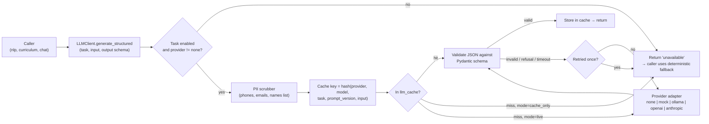

**Interface (conceptual):**
- `generate_structured(task, input, schema) → result | unavailable`
- The caller **always** has a deterministic fallback.

**Provider adapters:**
| Provider | Use | Notes |
|---|---|---|
| `none` (**default**) | Demo and CI | Always returns "unavailable". P0 behaviour. |
| `mock` | Tests | Returns fixture responses |
| `ollama` | Free local model | Runs a small instruct model locally, if laptops have enough RAM *(test early)* |
| `openai` | Optional cloud | Uses the provider's official SDK; costs money |
| `anthropic` | Optional cloud | Uses the official `anthropic` Python SDK; costs money |

**Anthropic adapter notes** (only relevant if the team enables it):
- Request JSON through the SDK's **structured outputs** feature (`output_config.format`, or the SDK's `messages.parse()` helper) rather than parsing free text.
- Always check `stop_reason` (e.g. `refusal`, `max_tokens`) before reading content. Treat anything other than a normal end as "invalid", so the fallback applies.
- The model ID lives in `config/llm.yaml` (e.g. `claude-opus-5`), not in code.

**Cross-cutting rules:**
- **Modes:** `live`, `cache_only` (the demo: only pre-warmed answers, no network), `off`.
- **Budget guard:** a maximum number of LLM calls per job (config). When exceeded → "unavailable".
- **Prompt templates are versioned files** (`llm/prompts/<task>_v<N>`). Changing a prompt bumps its version, which invalidates only that task's cache.
- **Pre-warming:** before the demo, run the LLM tasks once in `live` mode (if an LLM is used at all), then switch to `cache_only`. The demo output is then identical every time (AIQ-2).

### 4.7 Where an LLM is used (all optional)
| # | Task | Input → output | Guardrail |
|---|---|---|---|
| L1 | Hard-posting extraction (stage 4) | Posting text → list of skill *phrases* + band hints (JSON) | Phrases re-mapped through stages 1–3; never creates skills |
| L2 | Module outline polishing (F9, P1) | Template outline (from DB) → clearer wording (JSON with the same fields) | Output validated: it may only reference the skill and equipment IDs given; hours stay within the template range; labelled "Draft" |
| L3 | Consultation notes → insights (P1) | Interview notes → skills mentioned, pain points, candidate quotes | Goes to human review before use; quotes need approval |
| L4 | Chatbot intent and slot parsing (P1) | Candidate message → `{intent, district, education, interest}` (JSON enums only) | Enum-only schema; the answer is built from the DB (§4.9) |
| L5 | Explanation paraphrase (P1, **off by default**) | Template sentence + facts → friendlier sentence in hi/mr | Number-consistency validator (§4.9); fallback to the template |

### 4.8 Where an LLM is NOT needed (and must not be used)
- All **scores and formulas**: demand, openings, supply, mismatch, trends, forecast, coverage, health, ranking, priority, confidence.
- **Recommendation rules** (ADD/UPDATE/DEMOTE/seats/ToT/equipment).
- **Evidence generation** (template sentences filled with database values).
- **District mapping, deduplication, alias matching, band rules.**
- **The PDF content** (assembled from the database via templates).
- **Fixed UI translations** (human-written).
- **Auth, RBAC, validation status, pledge totals.**

### 4.9 Preventing chatbot hallucination (P1 chat; the same design protects the Telegram bot)

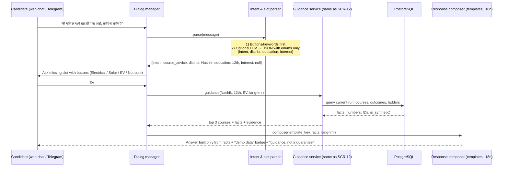

**Hallucination controls:**
1. **The LLM never answers.** At most, it converts free text into a fixed JSON of **enums** (L4). Answers are always composed from **database facts via templates**.
2. **Closed domain.** Only supported intents (course advice, career next step, what a course teaches, help). Anything else gets a polite scope message and buttons.
3. **Slot validation.** A district must be one of the 4, and education and interest must match the enums. Otherwise the bot asks again with buttons.
4. **"I don't know" by default.** If the database has no data for the combination, the bot says so and offers the closest supported option. It never estimates.
5. **Number-consistency check** (only if the paraphrase L5 is enabled): every number in the output must appear in the facts set. If not, the template text is used instead.
6. **Grounding metadata:** every answer carries the pipeline run ID, the demo-data badge and a confidence label.
7. **No personal data** is stored or sent to the LLM. Sessions are in-memory with a short TTL.
8. **Tests:** fixed conversation scripts (including off-topic and trick questions) with expected outputs, run in CI with the `mock` provider.

---

## 5. Data pipeline architecture

### 5.1 Two pipelines
| Pipeline | Trigger | Output |
|---|---|---|
| **Ingestion** (per source file or submission) | `load-demo`, CSV upload (P1), survey submission, simulated event | Fact and reference rows with provenance; `ingestion_run` log; review items |
| **Analytics** (whole system) | `run-pipeline`, admin "Run pipeline", after a simulated event, after load | A new `pipeline_run` with all derived tables; atomically made current |

### 5.2 Ingestion pipeline (per file)
```
read file (UTF-8) → schema check (required columns) → row validation
  → reference checks (district, skill, role, course IDs exist)
  → provenance stamping (source_id from data_source registry, fetched_at, is_synthetic, ingestion_run_id)
  → normalisation (district mapping, text cleaning, PII scrubbing)
  → dedupe (dedupe_key)
  → upsert (idempotent by natural key)
  → NLP extraction job for text rows (postings, survey free text)
  → ingestion_run summary (loaded / rejected with reasons)
```
Rejected rows go to `ingestion_error` with the file, row number and reason (FR-1.4). **Nothing is silently dropped.**

### 5.3 Analytics pipeline (DAG)

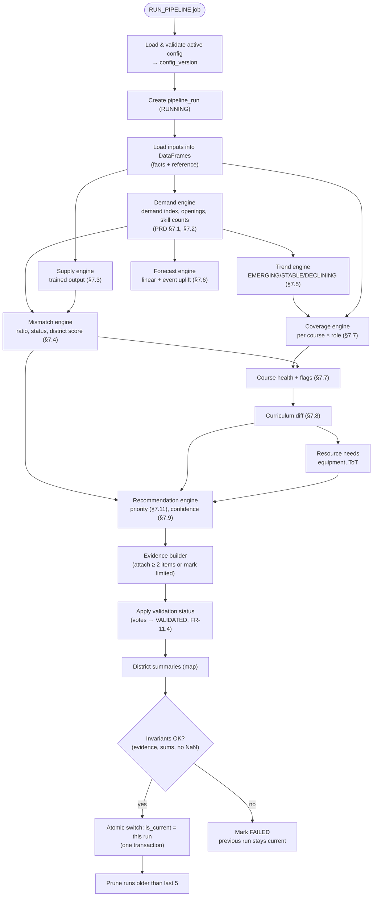

**Step contracts:**
| Step | Reads | Writes | Must satisfy |
|---|---|---|---|
| Demand | `posting_skill`, `posting_role`, `survey_*`, `sector_event` | `demand_score`, `openings_estimate` | Components sum to the score; confidence set |
| Supply | `course_offering`, `course`, role mappings | `supply_estimate` | Contributing offerings listed (FR-4.2) |
| Mismatch | Demand + supply | `mismatch`, `district_summary` | Status thresholds from config |
| Trend | `posting_skill` by quarter | `skill_trend` | PP-1 → EMERGING, PP-4 → DECLINING (tests) |
| Forecast | Demand history, `sector_event` | `forecast` | Uplift only inside the lag window (AC-7) |
| Coverage / health | Modules, role_skill, trends, outcomes | `course_coverage`, `course_health` | Breakdown sums to the score ± 1 (AC-8) |
| Curriculum / resources | Coverage, trends, equipment, trainers | `curriculum_change`, `resource_need` | Rules per PRD §7.8 |
| Recommendations | All of the above | `recommendation` (upsert by fingerprint), `recommendation_snapshot`, `evidence` | Every snapshot has ≥ 2 evidence items or `limited_evidence = true` (EXP-2) |

**Performance budget (NFR-1):** with ~2,500 postings, ~300 skills, ~25 roles, ~40 offerings and ~1,000 candidates, the whole analytics pipeline should take **< 20 s** in pandas. The heavy work (NLP extraction, embeddings) happens at ingestion and is cached. The step timings are stored in `pipeline_run.step_timings_json` and shown on SCR-14.

### 5.4 Simulated event → updated dashboards (F19, GP-1)

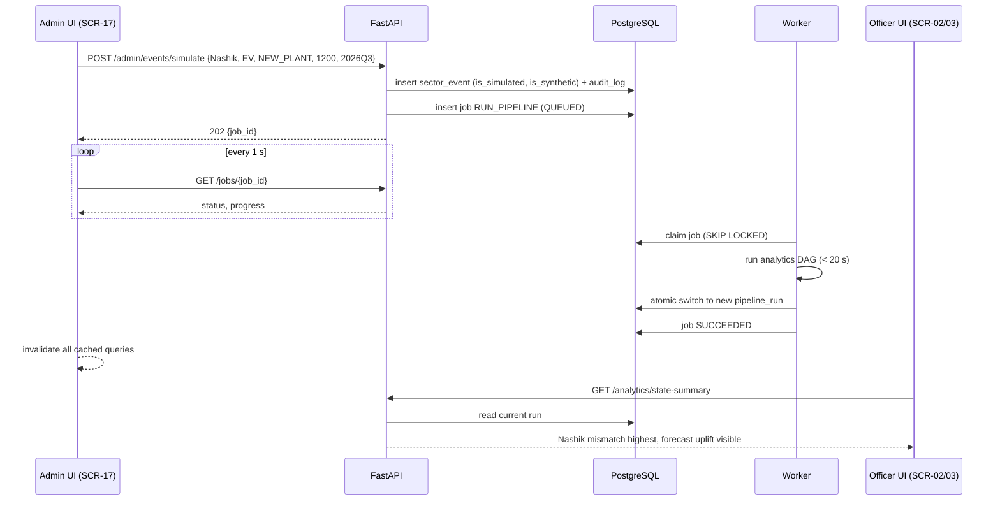

### 5.5 Idempotency and consistency
- Loaders upsert by natural keys, so re-running a load changes nothing (FR-1.5).
- The pipeline never updates derived rows in place. It writes a **new run**, then switches it in **one transaction**, so readers never see half-computed results.
- Human decisions (votes, pledges, plan items) live in persistent tables and are **re-applied** every run.

---

## 6. Frontend architecture

### 6.1 Structure

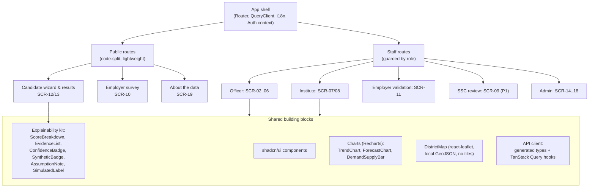

### 6.2 Folder layout
```
frontend/src/
  app/            # router, providers, layout, role guards, error boundary
  features/
    state/ district/ recommendations/ plans/      # officer
    institute/                                     # SCR-07/08
    employer/                                      # survey (public), validation (auth)
    candidate/                                     # wizard, results, career path
    admin/                                         # data, review, quality, events, config
    ssc/                                           # P1
    about/
  components/ui/          # shadcn/ui generated components
  components/explain/     # explainability kit (§10.4)
  components/charts/      # Recharts wrappers
  components/map/         # DistrictMap
  lib/api/                # generated types (openapi-typescript), fetch wrapper, query keys
  lib/auth/               # token handling, role helpers
  i18n/{en,hi,mr}/        # namespaces: common, candidate, employer, evidence
  assets/geo/             # simplified district GeoJSON (small file)
  assets/fonts/           # Noto Sans + Noto Sans Devanagari (self-hosted, for offline)
```

### 6.3 Data fetching and state
- **TanStack Query** for all server state. Query keys include `district`, `quarter` and `runId`, so a new pipeline run naturally refreshes the data.
- After mutations (vote, pledge, add to plan, simulate event, reset), invalidate the related query keys. After reset or a pipeline job: **invalidate everything**.
- **Job polling:** `useJob(jobId)` with a 1 s refetch interval until it succeeds or fails.
- **Auth state:** a small React context. No Redux.
- **Types:** `openapi-typescript` generates types from `/api/openapi.json` in a build step (`npm run gen:api`). **Never hand-write API types.**

### 6.4 Routing and guards
- Public: `/`, `/guidance`, `/guidance/results`, `/survey`, `/about`
- Staff: `/state`, `/district/:lgd`, `/district/:lgd/roles/:roleId`, `/recommendations`, `/plans/:id`, `/institute`, `/institute/courses/:offeringId`, `/employer/validate`, `/ssc` (P1), `/admin/*`
- `RoleGuard` redirects to the user's home if the role doesn't match. The **server still enforces** access (§8). UI guards are only for convenience.
- The demo-mode role switcher is rendered only if `/auth/me` reports `demo_mode: true`.

### 6.5 Internationalisation
- react-i18next, with namespaces loaded per route.
- The candidate and employer screens are fully translated (en, hi, mr). Staff screens are English-only (FR-X.3).
- The language choice is stored in `localStorage` (a convenience only).
- **Evidence sentences are translatable:** the API returns `summary_key + params`, and the frontend renders them with i18n (§9.4). Staff screens use English templates.
- Fonts: self-hosted **Noto Sans Devanagari** so Hindi and Marathi render offline *(TODO-VERIFY the font license, expected SIL OFL)*.

### 6.6 Maps and charts
- **DistrictMap:** react-leaflet `GeoJSON` layer from `assets/geo/districts_mvp.geojson` (the 4 districts, simplified to a small file size). The tile layer is **off by default** (offline). It can optionally be turned on when online, following the tile provider's usage policy and attribution.
- Colour + **text label** for each district's status (NFR-8: colour is never the only signal).
- **Fallback:** if the map fails to load, show a ranked table (cut-list item 3).
- **Charts (Recharts):** trend line, forecast line with a shaded range, demand vs supply bars, and a health-breakdown bar. All charts have text summaries for accessibility.

### 6.7 Performance and mobile
- Candidate and employer routes are **code-split** and don't import Leaflet or Recharts, so the bundle stays small on slow connections (NFR-7).
- Designed at 360 px first for the public routes.
- Every screen has skeleton loading states, empty states and error states with a retry button.

---

## 7. API architecture

### 7.1 Conventions
- Base path `/api/v1`. JSON only. OpenAPI documentation at `/api/docs` (disabled in hosted production, if desired).
- Nouns for resources, and actions as sub-resources (`/recommendations/{id}/status`).
- **Sync endpoints** (ADR-05). Long operations return **202 + job ID**.
- **Every analytic response** includes:
  - `meta`: `pipeline_run_id`, `config_version`, `computed_at`, `quarter`
  - per value: `confidence`, `synthetic_share` (or `is_synthetic`), and, where relevant, `components[]` and `evidence[]` (§10.2)
- List endpoints: `?page=&size=` plus filters, returning `{items, total, page, size}`.
- Time periods: always the `quarter` string format (`2026Q3`).

### 7.2 Endpoint groups
| Group | Method & path | Purpose | Access |
|---|---|---|---|
| Health | `GET /health`, `GET /health/ready` | Liveness; readiness (DB up, current run exists) | Public |
| Auth | `POST /auth/login` | Get a JWT | Public |
| | `GET /auth/me` | User, role, scope, `demo_mode` | Staff |
| | `POST /auth/demo/switch` | Switch to a seeded demo account | Staff, **only if DEMO_MODE** |
| Reference | `GET /districts`, `/sectors`, `/roles`, `/roles/{id}`, `/skills?q=`, `/skills/{id}`, `/courses`, `/qps` | Lookups | Staff |
| Analytics | `GET /analytics/state-summary?quarter=` | Map + comparison (SCR-02) | State officer, admin |
| | `GET /analytics/districts/{lgd}/dashboard?quarter=` | SCR-03 | Officers (district scope), admin |
| | `GET /analytics/districts/{lgd}/roles/{roleId}` | Trend, forecast, evidence (SCR-04) | Officers, admin |
| | `GET /analytics/districts/{lgd}/skills/trends` | Emerging / declining | Officers, SSC, admin |
| | `GET /analytics/explain/{subjectType}/{subjectId}` | Breakdown + evidence for any score | Any staff with access to the subject |
| Courses | `GET /institutes/{id}/offerings` | SCR-07 | Institute (own), officers |
| | `GET /offerings/{id}/health`, `/curriculum-diff`, `/resources` | SCR-08 | Institute (own), officers |
| Recommendations | `GET /recommendations?district=&type=&status=&priority=` | SCR-05 | Officers; institute (own, read) |
| | `GET /recommendations/{id}` | Detail + evidence + votes + pledges | Same |
| | `POST /recommendations/{id}/status` | `IN_PLAN` / `REJECTED` (officer); `IMPLEMENTED` (P1) | Officers (district scope) |
| Employer | `GET /employer/recommendations` | Validation cards for the employer's district | Employer |
| | `PUT /employer/recommendations/{id}/vote` | Approve / Reject / Not needed + comment | Employer |
| | `POST /employer/recommendations/{id}/pledges` | Pledge | Employer |
| Public | `POST /public/surveys` | Employer survey (consent required) | Public, rate-limited |
| | `GET /public/guidance/options` | Districts, education levels, interests, languages | Public |
| | `POST /public/guidance` | Top 3 courses + career paths | Public, rate-limited |
| | `POST /public/chat` (P1) | Grounded chat (§4.9) | Public, rate-limited |
| | `GET /public/about` | Sources, attributions, formula summaries, config version | Public |
| Plans | `POST /plans` `{district, quarter}` | Generate a plan (201, or 202 + job) | District officer (own), state officer |
| | `GET /plans/{id}`, `GET /plans/{id}/pdf` | Preview / download | Same |
| Jobs | `GET /jobs/{id}` | Job status | The job's creator, admin |
| Admin | `POST /admin/demo/load`, `POST /admin/demo/reset` | Load / reset (202) | Admin |
| | `POST /admin/pipeline/run` | Run the pipeline (202) | Admin |
| | `GET /admin/ingestion-runs`, `GET /admin/data-quality` | SCR-14/16 | Admin |
| | `GET /admin/review-items`, `POST /admin/review-items/{id}/resolve` | SCR-15 | Admin |
| | `GET/POST /admin/events`, `DELETE /admin/events/{id}` | Simulate events (SCR-17) | Admin |
| | `GET/PUT /admin/config` (P1) | Config versions (SCR-18) | Admin |
| | `GET /admin/audit` | Audit log | Admin |
| Webhooks | `POST /webhooks/telegram/{secret}` | Telegram updates (hosted mode only; locally the bot polls) | Telegram, secret path |

### 7.3 Public endpoint hardening
Input validation with enums, request size limits, per-IP rate limits (e.g. N requests per minute per IP, configurable), no personal fields accepted, and consent required for surveys (FR-12.2).

### 7.4 Error format
One consistent shape: `error.code` (machine-readable, e.g. `FORBIDDEN_SCOPE`, `VALIDATION_FAILED`, `NOT_FOUND`, `JOB_FAILED`), `error.message` (human-readable) and `error.details` (field errors). HTTP codes: 400/401/403/404/409/422/429/500.

### 7.5 Long-running operations
`POST` → `202 Accepted {job_id}` → `GET /jobs/{id}` → `{status, progress, message, result_ref}`. The UI shows a progress indicator. On `SUCCEEDED` it invalidates its queries; on `FAILED` it shows the message, and the previous results are still being served.

### 7.6 Contract management
FastAPI's OpenAPI schema is the **single contract**. The frontend generates its types from it. Breaking changes require updating both sides in the same pull request. `/api/v1` stays stable during the hackathon.

---

## 8. Authentication and RBAC architecture

### 8.1 Identity model
- `app_user`: `email`, `password_hash`, `role`, `scope_type`, `scope_id`, `display_name`, `language`, `is_demo`.
- **Roles:** `state_officer`, `district_officer`, `institute_admin`, `ssc_reviewer`, `employer`, `admin`. **Candidates are anonymous** (no accounts; non-goal 9).
- **Scopes:**

| Role | Scope type | Scope ID |
|---|---|---|
| state_officer | `STATE` | e.g. Maharashtra |
| district_officer | `DISTRICT` | LGD code |
| institute_admin | `INSTITUTE` | Institute ID |
| employer | `EMPLOYER` | Employer ID (which has a district) |
| ssc_reviewer, admin | `GLOBAL` | — |

### 8.2 Tokens and passwords
- Login returns a **JWT access token** (HS256; secret from the environment; ~60-minute expiry) with the claims `sub`, `role`, `scope_type`, `scope_id` and `demo`.
- Frontend storage: in memory + `sessionStorage` (cleared when the tab closes). No refresh tokens in the MVP.
- Passwords are hashed with argon2 (or bcrypt). Demo passwords are unique and never reused elsewhere (SEC-3).

### 8.3 Enforcement (defence in depth)

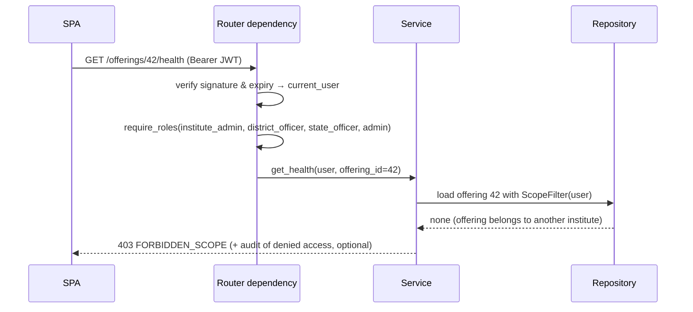

1. **Route level:** a `require_roles(...)` dependency on every non-public router.
2. **Data level:** a `ScopeFilter` built from the user and applied inside repository queries. An institute admin physically cannot query another institute's rows.
3. **Tests:** every protected endpoint has a test for the allowed role, a wrong role (403) and a wrong scope (403) (AC-20).

### 8.4 Permission matrix (MVP)
| Resource / action | State officer | District officer | Institute admin | SSC reviewer | Employer | Admin | Public |
|---|---|---|---|---|---|---|---|
| State summary (map) | R | R (own district highlighted) | — | R | — | R | — |
| District dashboard | R (all) | R (own) | R (own district, read) | R | — | R | — |
| Course health / diff / resources | R | R (own district) | R (own institute) | R | — | R | — |
| Recommendations list / detail | R | R (own) | R (own institute) | R | R (own district, cards) | R | — |
| Recommendation status → IN_PLAN / REJECTED | — | W (own) | — | — | — | W | — |
| Vote / pledge | — | — | — | — | W (own) | — | — |
| Generate / download plan | W/R | W/R (own) | — | — | — | W/R | — |
| Module draft approve (P1) | — | — | — | W | — | W | — |
| Survey submit | — | — | — | — | — | — | W |
| Guidance / about | — | — | — | — | — | — | R |
| Admin data / pipeline / events / config / audit | — | — | — | — | — | W/R | — |

### 8.5 Demo mode
- `DEMO_MODE=true` enables `POST /auth/demo/switch {role}`, which issues a token for the seeded account of that role (e.g. the Nashik district officer).
- Every switch is audit-logged. A permanent "DEMO MODE" banner is shown in the UI.
- **In any hosted deployment shared publicly, `DEMO_MODE` must be off**, or at least the switch endpoint must require the admin role.

---

## 9. Evidence and provenance architecture

### 9.1 Lineage: from source to PDF

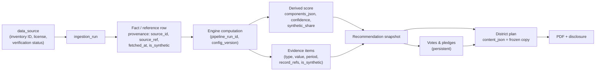

### 9.2 Provenance
- **`data_source` registry:** loaded from `data/research/source_inventory.csv`. It holds `source_id`, `name`, `organisation`, `url`, `license_name`, `license_notes`, `classification`, `verification_status`. Every fact row references a `source_id` (a foreign key), so **an untracked source cannot be loaded**.
- `ingestion_run` records *when* and *how* data arrived.
- **The About page (SCR-19) reads from `data_source`**, so attributions are always in sync with the data actually loaded (SEC-10).

### 9.3 Evidence object model
| Field | Meaning |
|---|---|
| `subject_type`, `subject_id` | What the evidence supports (recommendation snapshot, demand score, course health, forecast, mismatch, skill trend) |
| `evidence_type` | `POSTING_COUNT`, `POSTING_TREND`, `SURVEY`, `EVENT`, `CONSULTATION_QUOTE`, `PLACEMENT`, `COVERAGE`, `EMPLOYER_VOTE`, `ASSUMPTION` |
| `summary_key` + `params` | A template key and values, e.g. `evidence.posting_trend` + `{skill, district, count, prev, change_pct, period}`. Rendered in any language, with **no LLM**. |
| `value`, `unit`, `period` | The headline number |
| `source_types[]`, `source_ids[]` | Which kinds of source and which `data_source` entries contributed |
| `record_refs` | Up to N sample record IDs (e.g. 5 posting IDs), for "show me the data" drill-down |
| `is_synthetic` | True if any contributing record is synthetic |
| `weight` | How much this item contributed (optional) |

### 9.4 How evidence follows every recommendation (mechanism)
1. **Same code path.** The recommendation engine calls the `EvidenceBuilder` while it evaluates each rule. The facts that *triggered* the rule become the evidence. Evidence isn't gathered afterwards, so it cannot disagree with the rule.
2. **Minimum evidence invariant.** Before the atomic run switch, the pipeline checks that every active recommendation snapshot has ≥ 2 evidence items, or `limited_evidence = true` with confidence LOW (EXP-2). A violation fails the run, and the previous run stays current.
3. **The API contract requires it.** The recommendation response schema has a required `evidence` array and `confidence`, and the UI component cannot render a recommendation without them.
4. **Votes become evidence.** At each run, employer votes on a recommendation are added as `EMPLOYER_VOTE` evidence items.
5. **Frozen in plans.** When a plan is generated, the recommendation, its evidence, votes and pledges are **copied** into `district_plan.content_json`. The PDF can be regenerated identically even after later runs change things.
6. **Tested.** AC-22 samples recommendations and checks the evidence count. Pipeline invariant tests run in CI.

### 9.5 Synthetic propagation
`synthetic_share` = the share of contributing records that are synthetic (weighted by contribution). Any value with `synthetic_share > 0` shows the "demo data" badge. Evidence items carry their own `is_synthetic`. Simulated events carry `is_simulated` and are always labelled "Simulated".

---

## 10. Explainability architecture

### 10.1 Components model (every score)
Each derived score row stores `components_json`: a list of components with:
- `name`, `label_key` (i18n)
- `raw_value`, `normalised_value` (0–1 or 0–100)
- `weight`, `contribution` (normalised × weight)
- `unit`, `is_assumption`
- `formula_id` (e.g. `health.v1`)

**Invariant:** the sum of the contributions (± penalties) equals the displayed score (± 1 for rounding). This is tested (AC-8).

### 10.2 Explain API
`GET /analytics/explain/{subjectType}/{subjectId}` returns:
- the score and its confidence (+ the rule that produced the confidence)
- the components
- the assumptions used (config keys and values)
- the evidence items
- the formula ID with a plain-language description key
- `meta` (run, config version)

Every score in the UI opens this in a drawer (EXP-1).

### 10.3 Formula registry and config versions
- A small **formula registry** maps `formula_id` → a plain-language explanation (i18n keys), shown on the About page (EXP-8) and in drawers.
- `scoring_config_version` stores the full YAML and its hash. Every derived row references `config_version`, so a number can always be traced back to the exact weights that produced it.
- (P1) The config editor creates a new version. It becomes active only after admin approval, and is audit-logged.

### 10.4 UI explainability kit
| Component | Shows |
|---|---|
| `ScoreBreakdown` | A stacked bar or table of the components, weights and contributions, with a formula link |
| `EvidenceList` | Evidence sentences with value, period, source type, real/demo badge and a "view records" link |
| `ConfidenceBadge` | High / Medium / Low, with a tooltip explaining the rule (EXP-4) |
| `SyntheticBadge` | "demo data" wherever `synthetic_share > 0` |
| `AssumptionNote` | "Assumption: only ~30% of openings are posted online (configurable)" (EXP-5) |
| `SimulatedLabel` | "Simulated event" chip (EXP-6) |
| `MethodTag` | "matched by alias / fuzzy / embedding / LLM", "drafted from template" (EXP-9) |

### 10.5 Candidate-facing explanations
The "why this course" text is assembled from ranking components with **templates** in the candidate's language (EXP-7), e.g. "Recommended because {role} jobs in {district} are rising, and {placed} of {completed} recent trainees found jobs." The badge and "guidance, not a guarantee" text are always present (FR-15.4).

---

## 11. Privacy and security architecture

### 11.1 Data classification
| Class | Examples | Handling |
|---|---|---|
| Public reference | Syllabi, QPs, district codes | Stored with provenance and attribution |
| Business (non-personal) | Survey answers (business type, needs), votes, pledges | Stored; shown only in aggregate beyond the owning employer |
| Pseudonymous synthetic | Demo candidates, trainers (T-01) | Synthetic only; never real people |
| **Personal (avoid)** | Names, phone numbers, emails, Telegram IDs, Aadhaar | **Not stored in the app.** Real outreach contacts are kept outside the repository and deleted after the hackathon. Telegram user IDs are used only in memory for the session. If deduplication is needed, store a salted hash, and delete it after the event. |
| Secrets | JWT secret, DB password, API keys, bot token | Environment files only, never committed (`.env` in `.gitignore`); `.env.example` has placeholders |

### 11.2 Threat model (lite)
| Threat | Mitigation |
|---|---|
| Unauthorised data access across institutes or districts | Role + scope enforcement at router and repository level; tests (§8.3) |
| Token theft | Short expiry; HTTPS when hosted; no tokens in URLs; sessionStorage (not localStorage) |
| Public form abuse (spam) | Rate limiting, validation, enums, size limits (§7.3) |
| Injection (SQL / template) | ORM parameterised queries; Jinja2 autoescape in PDF templates; no raw SQL from user input |
| Prompt injection via posting text into the LLM | LLM output is enum/JSON only, validated, and can only reference existing IDs; the LLM never decides actions (§4.6–4.9) |
| Personal data leaking to an external LLM | PII scrubber before any LLM call; provider `none` by default (AIQ-4) |
| Personal data in logs | Structured logging without bodies; scrubbing filter; no free-text fields logged |
| Demo switcher exposed publicly | `DEMO_MODE` off in public hosting (§8.5) |
| Dependency vulnerabilities | Pinned lockfiles; run `pip-audit` / `npm audit` before the freeze |
| Accidental real-data misuse in the pitch | The synthetic flag and badges; the pitch rule (SYN-7) |

### 11.3 Privacy-by-design practices
Aligned in spirit with the DPDP Act 2023 (*specific obligations TODO-VERIFY*):
- **Consent first** on the survey. A **privacy notice** on the survey and candidate screens (SEC-9).
- **Purpose limitation:** data is used only for demand estimation and guidance.
- **Data minimisation:** candidates are anonymous; only aggregate guidance counts are logged.
- **Retention:** contact lists are deleted after the event. The demo database can be wiped with a reset.
- **Transparency:** the About page lists every source and method.

### 11.4 Other controls
CORS is restricted to the web origin (not needed when nginx serves both). Security headers are set in nginx (e.g. `X-Content-Type-Options`, a basic CSP). The DB port is bound to `127.0.0.1` locally. There are no default passwords in hosted mode.

---

## 12. Synthetic-data architecture

### 12.1 Generator design

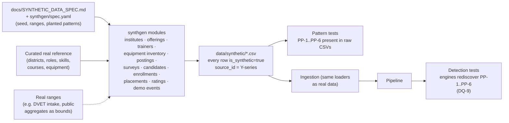

- **A separate package (`synthgen`) that only writes CSVs.** It never writes to the database directly, so synthetic data flows through the **same validation and provenance path** as real data.
- **Deterministic:** one seed in `spec.yaml` drives all randomness. The same seed always produces byte-identical CSVs (NFR-3).
- **Grounded in the real reference data:** it generates postings using real skill aliases (so NLP is exercised realistically), offerings for real course definitions, and seat ranges bounded by real intake figures where available.
- **Planted patterns** are declared in `spec.yaml` (PP-1…PP-6, PRD §16) with their parameters, e.g. PP-1: growth of +X% per quarter for skills {…} in {Nashik, Pune}.
- **Fictional names only** for institutes, employers and trainers ("Example ITI A", "Example EV Services", "T-01") (SYN-2).

### 12.2 How synthetic data is labelled (every layer)
| Layer | Label |
|---|---|
| CSV | `is_synthetic=true` column + `source_id` from the Y-series in the inventory |
| Database row | `is_synthetic` (facts); `is_simulated` (events created in the demo) |
| Derived value | `synthetic_share` (0–1), computed from the contributing records |
| Evidence item | `is_synthetic` |
| API | `is_synthetic` / `synthetic_share` on every analytic value |
| UI | "demo data" badge (`SyntheticBadge`); "Simulated" chip for events |
| PDF | A disclosure section + badges in tables (SYN-6) |
| About page | Lists which datasets are synthetic, and why |
| Pitch | "On synthetic data with planted patterns, the system detected…" (SYN-7) |

### 12.3 Tests
1. **Generator tests:** row counts, value ranges, no missing references, all rows flagged.
2. **Pattern-presence tests** on the CSVs (the patterns really are in the data).
3. **Detection tests** after the pipeline (the engines find them): these are the DQ-9 and golden-path checks.

---

## 13. Offline-demo architecture

### 13.1 What runs on the presenter laptop
| Needed at demo time | How it is available offline |
|---|---|
| Docker images (db, api/worker, web) | Pulled or built in advance; `docker compose up` works without the network |
| Database with the baseline state | Named volume + `generated/snapshots/demo_baseline.dump` |
| Embedding model files | Pre-downloaded into the `models` volume (or embeddings disabled) |
| LLM | Provider `none`, or `cache_only` with a pre-warmed `llm_cache` |
| Fonts (UI + PDF) | Bundled in the frontend assets and the backend image |
| Map shapes | Local GeoJSON; no tile server |
| Telegram | **Not on the golden path.** The web survey (SCR-10) is the P0 channel. |
| PDF rendering | WeasyPrint inside the container |

### 13.2 Running the entire demo locally (conceptual steps)
| Step | Action | Result |
|---|---|---|
| 1 | Install Docker Desktop (WSL2 backend); clone the repository **inside the WSL2 filesystem** (for speed) | Environment ready |
| 2 | Copy `.env.example` → `.env`; set `DEMO_MODE=true`, `LLM_PROVIDER=none` | Configured |
| 3 | `docker compose up -d` | db, api, worker and web running at `http://localhost:8080` |
| 4 | `kaushal generate-synthetic` then `kaushal load-demo` (run inside the api container) | Data loaded, NLP extracted, pipeline run, demo state seeded |
| 5 | `kaushal check-data` | DQ-1…DQ-9 pass |
| 6 | `kaushal snapshot` | Baseline saved |
| 7 | Rehearse the golden path; click **Reset demo** between rehearsals | ≤ 60 s reset (ADR-12) |
| 8 | **Disconnect Wi-Fi and rehearse again** | Proves offline readiness |

### 13.3 Laptop baseline
- 16 GB RAM recommended (8 GB minimum, with embeddings disabled). Give Docker/WSL2 about 6 GB via the WSL configuration.
- About 10 GB of free disk space.
- A browser with the site pre-opened in tabs for each role (optional). The role switcher makes this unnecessary.
- The **backup laptop** has an identical setup plus the recorded video (DEMO-1, DEMO-5).

---

## 14. Deployment architecture

### 14.1 Environments
| Environment | Purpose | Key settings |
|---|---|---|
| `dev` | Daily development | Vite dev server with hot reload; api with auto-reload; db in Docker; `DEMO_MODE=true`; `LLM_PROVIDER=none` or `mock` |
| `demo-offline` | **Primary demo** (presenter + backup laptop) | Production builds; nginx; `LLM_MODE=cache_only` or `none`; tiles off; bot off |
| `hosted-demo` (optional) | A shareable link for mentors or judges | Static frontend host + container host for api/worker + managed Postgres with pgvector; `DEMO_MODE` restricted; embeddings off if RAM is limited; bot webhook mode (optional) |
| `ci` | Automated checks | Postgres + pgvector service container; mock LLM; no embeddings (or a tiny model) |

### 14.2 Docker Compose services (local)
| Service | Image / build | Ports | Volumes | Notes |
|---|---|---|---|---|
| `db` | Postgres with pgvector (official pgvector image; **pin the exact tag**) | `127.0.0.1:5432` | `pgdata` | Health check `pg_isready` |
| `api` | `backend/Dockerfile` (Python + WeasyPrint system libraries + fonts + postgres client for dump/restore) | internal `8000` | `generated`, `models` (read-only), `data` (read-only) | `uvicorn`; waits for the db health check; runs `alembic upgrade head` on start |
| `worker` | Same image as api | — | Same | Command: the job worker |
| `web` | `frontend/Dockerfile` (multi-stage: node build → nginx) | `8080` | — | Serves the SPA; proxies `/api` → `api:8000` |
| `bot` (profile `bot`) | Same image as api | — | — | Telegram polling; only when online |
| `ollama` (profile `llm`, optional) | Ollama image | internal | `ollama` models | Only if the team chooses a local LLM and laptops can handle it |

### 14.3 Local deployment diagram

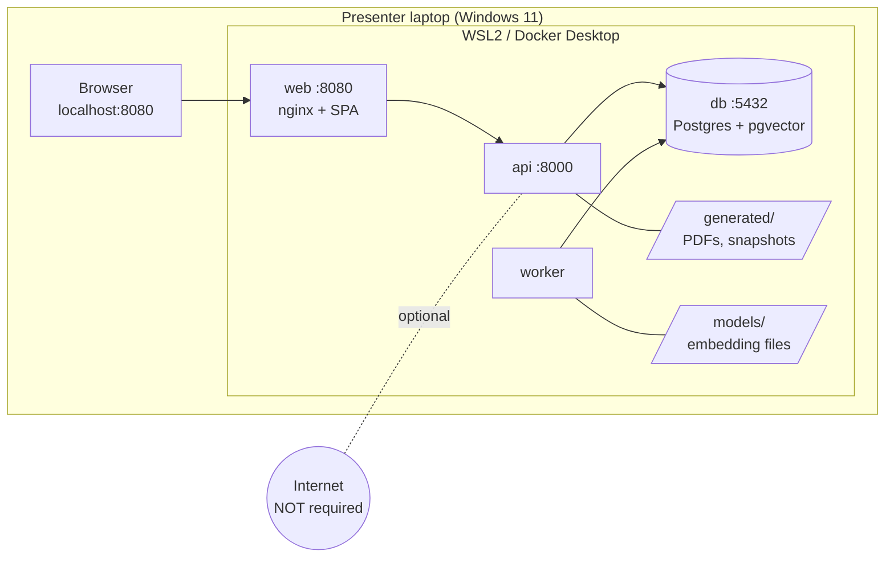

### 14.4 Optional hosted deployment

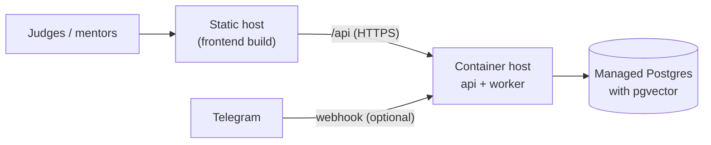

- Candidate hosts: a static host for the frontend; a container host for api/worker; a managed Postgres with pgvector. **Free-tier limits change often. TODO-VERIFY the current free tiers** (memory, sleep-on-idle, database size) before choosing.
- WeasyPrint needs system libraries, so the api must be deployed as a **Docker container**, not a "Python buildpack" (unless it supports those libraries).
- Low-RAM hosts: set `EMBEDDINGS_ENABLED=false` (skill vectors are precomputed, and runtime matching falls back to fuzzy matching).
- The hosted demo is a **nice-to-have**. The **offline laptop remains the primary demo** (NFR-2).

### 14.5 CI/CD (GitHub Actions)
| Job | Steps | When |
|---|---|---|
| `backend` | ruff, black --check, pytest (unit + API integration against a Postgres+pgvector service), `eval-nlp` threshold check | Every push / PR |
| `frontend` | eslint, prettier --check, `tsc --noEmit`, `gen:api` drift check, vite build | Every push / PR |
| `e2e` | docker compose up → load-demo → Playwright golden path (GP-1…GP-9) | Nightly + before the freeze (it takes longer) |
| `data` | `generate-synthetic` determinism check (hash) + `check-data` | On changes to `synthgen/` or `data/` |

### 14.6 Versions and reproducibility
- Pin the Python, Node and Postgres major versions in `README.md`. Pin exact library versions in lockfiles (`requirements*.lock` or a `uv`/`pip-tools` lock; `package-lock.json`).
- Pin Docker image tags (no `latest`).
- `.gitattributes` enforces LF line endings for shell scripts, Dockerfiles and SQL (a common Windows pitfall).

### 14.7 Testing architecture (summary)
| Level | Tool | Covers |
|---|---|---|
| Unit | pytest | Engines with hand-calculated fixtures (AC-5…AC-10); NLP stages; evidence builder; RBAC helpers |
| Integration | pytest + test DB | Loaders (idempotency, rejections), API endpoints (roles, scopes, schemas), pipeline invariants |
| Data | pytest / `check-data` | DQ-1…DQ-9, synthetic determinism, planted patterns |
| NLP quality | `eval-nlp` | AIQ-1 thresholds |
| End-to-end | Playwright | The golden path GP-1…GP-9; 360 px candidate flow in Marathi |

---

## 15. Failure and fallback architecture

### 15.1 Fallback table
| Component fails | Detected by | Fallback | What the user sees |
|---|---|---|---|
| **LLM provider** (down, slow, refusal, invalid JSON, no budget) | Adapter timeout, schema validation, `stop_reason` check | Deterministic path (templates, rules); `cache_only` in the demo | Same screens; `MethodTag` shows "template" |
| **Embedding model** (missing, out of memory) | Readiness check / load error | Skip stage 3; aliases + fuzzy only; review-queue suggestions via fuzzy | Slightly more review-queue items |
| **Telegram** (no internet, token issue) | Bot health / error log | Web survey form (SCR-10) is the P0 channel | Survey link instead of the bot |
| **Map** (GeoJSON / Leaflet error) | Error boundary | Ranked district table with status badges | Table instead of a map |
| **PDF engine** (WeasyPrint error, font issue) | Exception in the renderer | An HTML plan view with browser "Print to PDF" | A printable page instead of a download |
| **Pipeline run fails** (bug, invariant violation) | Job FAILED; invariant check | **Previous run stays current** (atomic switch never happens) | Old results + an admin error message |
| **Worker stopped** | Job stays QUEUED > 30 s | Admin restarts the worker; the CLI can run the pipeline directly | "Job waiting" indicator |
| **Database corruption / bad state** | Health check / wrong data | `reset-demo` from the snapshot; worst case, rebuild with `load-demo` | Reset in ≤ 60 s |
| **Internet down** | — | Nothing on the golden path needs it (§13) | No change |
| **Government portal changes or goes down** | — | No live dependency. All sources are pre-downloaded into `data/raw/`. | No change |
| **Laptop failure** | — | Backup laptop; recorded video | Seamless switch |
| **Low-confidence data** (few records) | Confidence rule | Show LOW confidence + caution; the recommendation is marked `limited_evidence` | Honest caution text |

### 15.2 How the system works if external APIs fail
The **golden path has zero required external API calls.**
- Data comes from local CSVs.
- Computation is local Python.
- Storage is local Postgres.
- The PDF is rendered locally.
- Map shapes are local.
- The LLM is off or cache-only.
- Telegram is optional.

External services only **enhance** the product (LLM wording, bot channel, hosted access), and each one has a fallback in §15.1. Readiness (`/health/ready`) reports which optional components are available, and the admin data page shows them, e.g. "LLM: off · Embeddings: on · Bot: off".

### 15.3 Degradation modes (config switches)
| Switch | Values | Effect |
|---|---|---|
| `LLM_PROVIDER` / `LLM_MODE` | `none` / `mock` / `ollama` / `openai` / `anthropic`; `live` / `cache_only` / `off` | Controls all LLM use |
| `EMBEDDINGS_ENABLED` | true / false | Stage 3 and the suggestions |
| `TELEGRAM_ENABLED` | true / false | Starts or stops the bot |
| `MAP_TILES_ENABLED` | true / false | Online tiles under the district shapes |
| `DEMO_MODE` | true / false | Role switcher, demo endpoints |

---

## 16. Quick answers to key questions

| Question | Answer | Details |
|---|---|---|
| **Why is PostgreSQL + pgvector sufficient?** | Tiny data, a shallow graph (1–3 hops) answered by joins and recursive CTEs, few vectors (ms exact search), and one system for integrity, JSONB, transactions, snapshots and vectors | §3.8, §3.9 |
| **Why NOT Neo4j initially?** | No query needs it. It would mean two sources of truth, a second query language, more RAM and demo risk, and a harder reset. Reconsider only for deep, dynamic graph queries, and even then start with a Postgres extension or a read-only replica. | §3.10 |
| **Where are embeddings used?** | Optional stage-3 skill matching, review suggestions, title → role fallback, syllabus-mapping help (P1), near-duplicates (P1), chat interest mapping (P1). **Never** in scores. | §4.3 |
| **Where is an LLM used?** | Optionally: hard-posting phrase extraction, module outline polishing (P1), consultation-note structuring (P1), chat intent/slot parsing (P1), explanation paraphrase (P1, off by default) | §4.7 |
| **Where is an LLM NOT needed?** | All scores, formulas, rules, evidence, mapping, dedupe, PDF, UI translations, auth and validation logic | §4.8 |
| **How do we prevent chatbot hallucination?** | The LLM only parses into enums. Answers are composed from DB facts with templates. Closed domain, slot validation, "I don't know" default, a number-consistency validator for any paraphrase, and scripted tests. | §4.9 |
| **How does evidence follow every recommendation?** | Built by the same code that fires the rule; a ≥ 2-items invariant checked before the run switch; required in the API schema; votes added as evidence; frozen into plans | §9.4 |
| **How is synthetic data labelled?** | At every layer: CSV flag → DB `is_synthetic` / `is_simulated` → derived `synthetic_share` → evidence flag → API field → UI badge → PDF disclosure → About page → pitch wording | §12.2 |
| **How does the system work if external APIs fail?** | The golden path needs none. Every optional external component has a deterministic or local fallback. | §15 |
| **How can we run the entire demo locally?** | Docker Compose (db, api, worker, web) on one laptop, with pre-downloaded models and fonts, local GeoJSON, LLM off or cache-only, a snapshot-based reset, and a Wi-Fi-off rehearsal | §13 |

---

## 17. Open decisions and TODO-VERIFY

| # | Item | Owner | By |
|---|---|---|---|
| 1 | Choose the embedding model after evaluating both candidates on the gold set; verify the license and Hindi/Marathi coverage | NLP lead | Week 2 |
| 2 | Decide whether any LLM is used at all (recommendation: start with `none`; add Ollama only if laptops cope) | Tech lead | Week 2 |
| 3 | Confirm spaCy tokenisation for `hi` / `mr`, or use a fallback tokeniser | NLP lead | Week 1 |
| 4 | Font license (Noto Sans Devanagari) and PDF Devanagari rendering test | Frontend + reports | Week 2 |
| 5 | Pin the Postgres / pgvector image tag and the Python / Node versions | Tech lead | Week 1 |
| 6 | District boundary file: license, simplification, match with the verified LGD codes | R5 | Week 1 |
| 7 | Hosted-demo provider free tiers (only if we do a hosted demo) | Tech lead | Week 3 |
| 8 | Telegram bot scope (survey only, or survey + candidate Q&A), given P1 status | Product | Week 2 |
| 9 | Whether the state officer can generate plans (PRD open question 3); affects the RBAC matrix | Product | Week 1 |

---

## Appendix A: Repository layout
```
kaushalsetu/
  backend/                 # FastAPI app (see §2.2), alembic/, tests/, Dockerfile, pyproject + lock
  synthgen/                # synthetic data generator (§12)
  frontend/                # React + Vite app (see §6.2), Dockerfile (node build → nginx), package-lock
  config/                  # scoring.yaml, sectors.yaml, llm.yaml, demo.yaml
  data/
    raw/<source_id>/       # original downloads + SOURCE_NOTE.md (gitignored if large)
    curated/               # real data cleaned into CSVs
    synthetic/             # generated CSVs (is_synthetic=true)
    gold/                  # gold-labelled postings
    geo/                   # district GeoJSON (simplified)
    research/              # source_inventory.csv (→ data_source table)
  generated/               # PDFs, snapshots (gitignored)
  models/                  # embedding model files (gitignored)
  docs/                    # 01-domain, 03-prd, 04-architecture, DATA_*, SYNTHETIC_DATA_SPEC, PROGRESS
  docker-compose.yml
  .env.example
  .gitattributes
  README.md
```

## Appendix B: Environment variables
| Variable | Example / values | Purpose |
|---|---|---|
| `DATABASE_URL` | `postgresql+psycopg://…@db:5432/kaushalsetu` | DB connection |
| `JWT_SECRET` | (random, long) | Token signing |
| `JWT_EXPIRES_MIN` | `60` | Token lifetime |
| `DEMO_MODE` | `true` / `false` | Role switcher, demo endpoints (§8.5) |
| `LLM_PROVIDER` | `none` / `mock` / `ollama` / `openai` / `anthropic` | LLM adapter (§4.6) |
| `LLM_MODE` | `off` / `cache_only` / `live` | Cache behaviour |
| `LLM_MODEL` | provider-specific model ID | Set in config, not code |
| `LLM_API_KEY` | (secret, if a cloud provider is used) | Provider credential |
| `LLM_MAX_CALLS_PER_JOB` | `50` | Budget guard |
| `EMBEDDINGS_ENABLED` | `true` / `false` | Stage 3 on/off |
| `EMBEDDING_MODEL_PATH` | `/models/<model-name>` | Local model files |
| `TELEGRAM_ENABLED` | `true` / `false` | Bot on/off |
| `TELEGRAM_BOT_TOKEN` | (secret) | Bot credential |
| `TELEGRAM_MODE` | `polling` / `webhook` | Local vs hosted |
| `MAP_TILES_ENABLED` | `false` | Online tiles |
| `SYNTH_SEED` | `20260929` | Deterministic synthetic data |
| `PUBLIC_RATE_LIMIT_PER_MIN` | `30` | Public endpoint protection |
| `LOG_LEVEL` | `INFO` | Logging |

---

*Change log*
- v0.1: first architecture specification for team review. No implementation.
