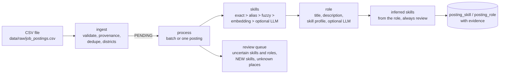

# Job intelligence pipeline

How KaushalSetu turns job ads into structured demand: **CSV import → skills → role →
requested proficiency → evidence**, with an optional, fenced-in LLM. Everything here runs at
Rs 0: the default LLM is a free deterministic mock, and meaning-based matching uses a small
local embedding model (docs/05-skill-matching.md).



## 1. Commands and API

From `backend/` with the venv active (database running):

| Goal | Command |
|---|---|
| Import + process a CSV | `python -m app.cli.jobs ingest [path]` (default `data/raw/job_postings.csv`; `--no-process` only imports) |
| Process everything still PENDING (batch) | `python -m app.cli.jobs process [--limit 100] [--retry-failed]` |
| Show a posting with its stored links and evidence | `python -m app.cli.jobs show <posting-id>` (`--dry-run`: run the pipeline now, store nothing) |
| Analyse any text, store nothing | `python -m app.cli.jobs try --title "EV Technician" --description "..."` |
| Measure quality | `python -m app.cli.jobs evaluate [--no-embeddings] [--llm] [--synthetic 300] [--out report.md]` |
| Vectors for meaning-based matching (after loading or changing the vocabulary) | `python -m app.cli.embed_skills` |

A synthetic sample to try: `data/synthetic/job_postings_sample.csv` (17 ads, messy on purpose;
source Y16). Copy it to `data/raw/job_postings.csv` (that folder is not in git).

API (admin only; log in first, see README):

| Endpoint | What it does |
|---|---|
| `POST /api/v1/ingestion/job-postings` | Import a CSV. Body `text/csv` (the file) **or** JSON `{"path": "data/raw/job_postings.csv"}` (a file under `data/` on the server). `?process=false` only imports; `?default_source=S05` fills rows without a source. Returns `records_seen`, `records_imported`, `duplicates`, `errors`, `skills_extracted`, `roles_matched`, and every rejected/duplicate/warned row with the reason. |
| `POST /api/v1/ingestion/job-postings/{id}/process` | Process one posting (`?dry_run=true`: show the result, store nothing). Synthetic postings that carry generator ground truth are refused (409) unless it is a dry run. |
| `POST /api/v1/ingestion/job-postings/process-batch` | Process PENDING postings (`?limit=100&retry_failed=true`). Each posting has its own savepoint: one failure is marked FAILED with the error and does not stop the batch. |
| `GET /api/v1/ingestion/job-postings/{id}` | The posting with its stored role and skills, their evidence and the source record. |

Example (PowerShell, after logging in as admin and putting the token in `$token`):

```powershell
Invoke-RestMethod -Method Post -Uri "http://127.0.0.1:8000/api/v1/ingestion/job-postings" `
  -Headers @{Authorization = "Bearer $token"} -ContentType "application/json" `
  -Body '{"path": "data/synthetic/job_postings_sample.csv"}'
```

## 2. Ingestion rules

* Columns: `title, description, employer, location, district, sector, posted_date, source,
  source_ref, license_note, is_synthetic` (case-insensitive; a few synonyms such as
  `posted_on`, `company` are accepted). Only `title` and `posted_date` are required columns.
* **Dates**: `YYYY-MM-DD`, `DD-MM-YYYY`, `DD/MM/YYYY`, `DD.MM.YYYY`, `12 Mar 2026` (day first,
  the Indian convention). Invalid, future or pre-2000 dates reject the row.
* **Missing description**: imported with a warning; skills can only come from the title.
* **Provenance** is kept on every posting: `source` (required, or `default_source`),
  `source_ref` (default `<file> row <n>`), `license_note` (default `TODO-VERIFY`, with a
  warning), `fetched_at`, `ingestion_run_id`, `is_synthetic`. A `Y..` source must be marked
  synthetic; a missing flag is taken from the source prefix (with a warning).
* **Privacy**: phone numbers and e-mail addresses are removed from the text before storing.
* **District**: from the district or location text: a code (`MH-NASHIK`), a name or spelling
  from `config/scope.yaml` (`Nasik`, `Poona`), or a known place
  (`data/reference/place_aliases.yaml`, e.g. `Ambad MIDC`; TODO-VERIFY against LGD). Unknown
  or ambiguous places keep the ad but leave the district empty and create a PLACE_MAPPING
  review item. Nothing is guessed.
* **Duplicates**: the same normalised title + employer + district + ISO week, within the file
  or already in the database (the key is shared with the synthetic generator). Skipped and
  reported with the row they duplicate.
* Every import writes an `ingestion_run` (rows loaded, rows rejected, every reason).

## 3. Finding skills (`app/nlp/job_extraction.py`)

Each step only looks at words that no earlier step explained:

1. **exact**: a skill name appears in the ad (confidence 1.0).
2. **alias**: a curated English/Hindi/Marathi alias appears (`alias_confidence`, 1.0). The same
   words naming two skills go to review.
3. **fuzzy**: a run of words is a spelling variant of a name or alias ("Domestic wirring",
   similarity ≥ 0.88; short single words are never spelling-matched).
4. **embedding**: the leftover words are cut into short phrases at connectors ("and", "with",
   "और", "आणि" …) with filler words removed ("required", "experience" …), and matched by
   meaning (e5-small + pgvector, docs/05-skill-matching.md). Words naming a job role ("EV
   technician") are left to role matching.
5. **LLM (optional)**: only for a phrase that is still uncertain AND has a candidate at review
   level (≥ 0.6); the LLM may only pick one of those candidates; its answer is capped at 0.80
   and always reviewed. A second, optional task (off by default) lets an LLM quote skill
   phrases from ads where nothing was found; the quotes must appear verbatim in the ad.

Decisions follow `config/scoring.yaml` `skill_matching`: accept ≥ 0.85, review ≥ 0.60.
Leftover phrases in a sentence that talks about skills ("Skills required: …, PLC
programming") become **NEW-skill** review items; skills are never added automatically.

**Requested proficiency** (`basic` / `intermediate` / `advanced` / `unknown`) comes from words
in the skill's clause ("basic knowledge of", "hands-on", "expert", "fresher", Hindi/Marathi
equivalents, `data/reference/job_text_cues.yaml`) or from the ad's years of experience ("2-4
years" → intermediate). It is what the ad **asks for**, never a certified level, and the
skill's own name never counts ("Basic Motor Maintenance" is not "basic").

## 4. Matching the role (`app/nlp/role_matching.py`)

Signals: the title IS a role title/alias (1.0) or contains one (0.92); only the description
mentions one (0.75); a misspelt title (fuzzy ≥ 0.88); a title with the same meaning
(embedding, only counted if at least one of the role's skills is in the ad); and the **skill
profile** (how typical the ad's skills are for each role). Text signals get a bonus when the
role's skills agree; a role guessed from skills alone is capped at 0.8 (always reviewed); two
roles closer than 0.05 → review; roles outside the ad's sector are penalised. An optional LLM
may pick one of the candidate roles (capped, reviewed). Official occupation codes are never
used or invented.

## 5. Evidence: OBSERVED, INFERRED, SYNTHETIC

Every stored link (`posting_skill`, `posting_role`) carries:

| Field | Meaning |
|---|---|
| `evidence_kind` | **OBSERVED**: found in this ad's text (quoted). **INFERRED**: not stated; implied by the matched role's essential skills (importance ≥ 0.9), always `review`, never counted as observed demand. **SYNTHETIC**: written by the synthetic generator as ground truth (the pipeline never changes these). |
| `method`, `confidence`, `decision` | EXACT / ALIAS / FUZZY / EMBEDDING / LLM / SKILL_PROFILE / ROLE_PROFILE / GENERATED / HUMAN; 0-1; `accept` or `review` |
| `matched_text`, `evidence_text` | the words of the ad that matched, and the sentence around them |
| `evidence_json` | field (title/description), character span, the vocabulary term, alternatives, similarity, proficiency cue, LLM provenance (provider, model, prompt version, generated_at, cache hit, input hash) |
| `is_synthetic` | copied from the posting; the posting's `source`, `source_ref`, `license_note` and `ingestion_run_id` are the source record |

Reprocessing replaces the pipeline's own links but keeps links a human confirmed (HUMAN) and
generator ground truth (GENERATED). Uncertain skills (SKILL_MAPPING), unknown skill phrases
(NEW_SKILL) and uncertain roles (ROLE_MAPPING) go to the `review_item` queue.

## 6. LLM layer (`app/llm/`)

* **One interface**, `LLMClient.run(task, payload)`, never raises for LLM problems: it returns
  a result with `ok`, the validated answer, the error, and provenance (provider, model, task,
  prompt version, generated_at, cache hit, attempts, input hash).
* **Providers**: `mock` (default; deterministic documented rules, no network, no key, Rs 0),
  `ollama` (local, free), `anthropic` and `openai` (official SDKs, installed only if you choose
  them; key only from `LLM_API_KEY` in `.env`). Chosen in `config/llm.yaml` or with
  `LLM_PROVIDER` / `LLM_MODE` / `LLM_MODEL`.
* **Guard rails** on every call: modes off / cache_only / live; per-task switches and prompt
  versions; timeout; retries with exponential backoff on errors, invalid JSON or invalid
  answers; a call budget per job; structured JSON output validated with Pydantic; grounding
  checks (a chosen skill/role must be one of the candidates, quoted phrases must appear in
  the ad, no URLs, no numbers that are not in the input); answers cached in `llm_cache`
  (reused offline in cache_only mode).
* **What an LLM may not do**: invent statistics, job counts, employer claims, placement numbers,
  government codes or URLs. The tasks are built so it can only choose among given candidates
  or quote the given text; the system prompt says so too, and the checks enforce it.
* The mock is a stand-in for development and demos. Its choices are simple word overlap, so
  it is **not** a measure of what a real LLM would do; the evaluation below runs without it.

## 7. Evaluation

Run: `python -m app.cli.jobs evaluate` (gold set, 52 hand-written ads; see
`data/gold/job_postings_gold.yaml`). Scores are for OBSERVED skills only, micro-averaged over
(ad, skill) pairs. Measured on 2026-09-30 with scoring config v3.

| Configuration | Accepted only: P / R / F1 | Accepted + review: P / R / F1 | Role accuracy |
|---|---|---|---|
| embeddings on, LLM off (default for evaluation) | 1.00 / 0.89 / 0.94 | 0.91 / 0.97 / 0.94 | 96% |
| embeddings off, LLM off (rules only) | 1.00 / 0.88 / 0.93 | 1.00 / 0.88 / 0.93 | 98% |
| embeddings on, mock LLM | 1.00 / 0.89 / 0.94 | 0.91 / 0.97 / 0.94 | 98% |

**Reading the numbers honestly**

* Everything the pipeline **accepts** automatically was right (precision 1.00), but it
  accepts only 89 % of the skills; meaning-based matches land in the **review** band, where
  they add 7 more right skills and 8 wrong ones (precision 0.91 with review). Meaning-based
  title matching also cost one role ("Receptionist" -> electrician, sent to review).
* Rules alone (no embeddings) never made a wrong match on this set but missed every
  paraphrase ("fault finding on scooters", "wall chargers for electric cars").
* The mock LLM changes no skill result and fixes one role by word overlap; it is a stand-in,
  not evidence of what a real LLM would do.
* Weakest area: **paraphrases** (F1 0.82). Two paraphrases were missed completely; generic
  single words ("Install", "motors", "Plant maintenance") produced review-level false matches.
* The gold set was written by the team that also wrote the aliases, so these are upper
  bounds for real ads.
* On 300 synthetic postings scored against the generator's ground truth the pipeline gets
  accepted P/R/F1 1.00 / 1.00 / 1.00 and 0.97 / 1.00 / 0.98 with review, and 100 %
  role accuracy. That is **optimistic by construction** (synthetic ads are written from the
  vocabulary's own names and aliases); it only shows that nothing is broken.

### Full report (embeddings on, LLM off)

### Gold set: 52 examples

Settings: embeddings = intfloat/multilingual-e5-small, LLM = off, scoring config = v3

| Skills (OBSERVED) | Precision | Recall | F1 | TP | FP | FN |
|---|---|---|---|---|---|---|
| accepted only | 1.00 | 0.89 | 0.94 | 72 | 0 | 9 |
| accepted + review | 0.91 | 0.97 | 0.94 | 79 | 8 | 2 |

**Role accuracy:** 96% (50/52). INFERRED skills proposed: 25 (of which 2 were stated in the gold labels; inferred skills are hints and are always reviewed).

| Category | Examples | Precision | Recall | F1 | Role accuracy |
|---|---|---|---|---|---|
| alias | 10 | 0.87 | 1.00 | 0.93 | 100% |
| ambiguous | 4 | 1.00 | 1.00 | 1.00 | 75% |
| exact | 5 | 1.00 | 1.00 | 1.00 | 100% |
| hindi | 5 | 1.00 | 1.00 | 1.00 | 100% |
| irrelevant | 6 | 1.00 | 1.00 | 1.00 | 83% |
| marathi | 4 | 0.88 | 1.00 | 0.93 | 100% |
| mixed | 1 | 1.00 | 1.00 | 1.00 | 100% |
| multi | 12 | 0.93 | 1.00 | 0.96 | 100% |
| no_description | 3 | 1.00 | 1.00 | 1.00 | 100% |
| semantic | 10 | 0.82 | 0.82 | 0.82 | 100% |
| spelling | 5 | 1.00 | 1.00 | 1.00 | 100% |
| unknown | 3 | 0.50 | 1.00 | 0.67 | 100% |

#### Missed skills (2)

| Example | Expected skill | Text |
|---|---|---|
| G19 | ev-diagnostics | EV Service Technician: Find faults in electric scooters and three-wheelers using |
| G25 | solar-inverter-maintenance | Solar Service Technician: Repair string inverters that show error codes at solar |

#### False matches (8)

| Example | Wrong skill | Method | Confidence | Matched words |
|---|---|---|---|---|
| G07 | solar-pv-installation | EMBEDDING | 0.65 | Install |
| G12 | motor-maintenance | EMBEDDING | 0.61 | submersible pump motors |
| G13 | solar-pv-installation | EMBEDDING | 0.70 | solar plants |
| G20 | ev-diagnostics | EMBEDDING | 0.73 | electric cars |
| G21 | solar-inverter-maintenance | EMBEDDING | 0.69 | Fix solar modules |
| G27 | solar-inverter-maintenance | EMBEDDING | 0.64 | Plant maintenance |
| G45 | solar-pv-installation | EMBEDDING | 0.60 | पंप दुरुस्ती |
| G49 | solar-inverter-maintenance | EMBEDDING | 0.71 | transformer maintenance |

#### Incorrect roles (2)

| Example | Expected | Predicted | Method | Confidence | Title |
|---|---|---|---|---|---|
| G32 | (none) | electrician | EMBEDDING | 0.58 | Receptionist |
| G35 | ev-charging-installer | electrician | EMBEDDING | 0.81 | Technician |

#### Low-confidence (review) skills (18)

| Example | Skill | Method | Confidence | Correct? | Matched words |
|---|---|---|---|---|---|
| G07 | solar-pv-installation | EMBEDDING | 0.65 | no | Install |
| G12 | motor-maintenance | EMBEDDING | 0.61 | no | submersible pump motors |
| G13 | solar-pv-installation | EMBEDDING | 0.70 | no | solar plants |
| G20 | ev-diagnostics | EMBEDDING | 0.73 | no | electric cars |
| G21 | solar-pv-installation | EMBEDDING | 0.69 | yes | rooftops |
| G21 | solar-inverter-maintenance | EMBEDDING | 0.69 | no | Fix solar modules |
| G22 | cable-installation | EMBEDDING | 0.74 | yes | Laying underground power cables |
| G22 | panel-wiring | EMBEDDING | 0.65 | yes | panels |
| G24 | battery-management | EMBEDDING | 0.72 | yes | Handle lithium battery packs |
| G26 | work-at-height | EMBEDDING | 0.72 | yes | wear a harness when |
| G27 | solar-inverter-maintenance | EMBEDDING | 0.64 | no | Plant maintenance |
| G34 | electrical-wiring | EMBEDDING | 0.83 | yes | Wiring |
| G35 | solar-pv-installation | EMBEDDING | 0.68 | yes | solar |
| G36 | solar-inverter-maintenance | EMBEDDING | 0.74 | yes | inverters |
| G37 | motor-maintenance | EMBEDDING | 0.67 | yes | motors |
| G42 | electrical-wiring | EMBEDDING | 0.72 | yes | घरगुती वायरिंग |
| G45 | solar-pv-installation | EMBEDDING | 0.60 | no | पंप दुरुस्ती |
| G49 | solar-inverter-maintenance | EMBEDDING | 0.71 | no | transformer maintenance |

#### Phrases sent to the review queue as possible NEW skills (6)

| Example | Phrase |
|---|---|
| G32 | hotel |
| G47 | PLC programming |
| G47 | SCADA |
| G47 | VFD commissioning |
| G48 | AutoCAD |
| G49 | DG set operation |


## 8. Limitations

* The vocabulary is the synthetic demo vocabulary (18 skills, 7 roles, Y13) until the curated
  Skill Graph exists; real ads will name many skills it does not have (they go to review).
* The gold set was written by the same team that wrote the aliases, so it is easier than real
  ads; treat its scores as an upper bound. It needs real, independently labelled ads (C07).
* Single generic words ("Install", "motors") can reach review-level embedding matches; that is
  why the review band exists.
* Proficiency comes from simple cue words and years of experience; "lead" in "lead-acid
  battery" can be misread as a level.
* Hindi/Marathi cue lists and aliases need checking by native speakers.
* Hindi vs Marathi is guessed from marker words; very short texts may be mislabelled.
