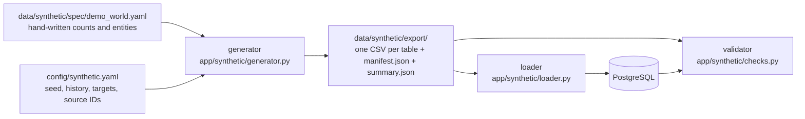

# Synthetic demo dataset: specification

> **Everything described here is SYNTHETIC.** It is a demonstration world built by the team
> to show that KaushalSetu's engines find known patterns. Institutes and employers are
> fictional ("Example …"), every number is a team assumption, and nothing here is an
> official statistic, a real company, a real syllabus or a government code.
> In the pitch we say: *"on synthetic data containing a planted pattern, the system
> detected …"* (docs/03-prd.md SYN-7).

## 1. Commands

Run these from `backend/` with the virtual environment active (`.venv\Scripts\Activate.ps1`)
and the database running (`docker compose up -d db`):

| Goal | Command |
|---|---|
| **Seed the database** (generate + load + validate) | `python -m app.cli.synthetic all` |
| Only write the CSV/JSON export | `python -m app.cli.synthetic generate` |
| Import the existing export into the database | `python -m app.cli.synthetic load` |
| **Validate** the data in the database | `python -m app.cli.synthetic validate` |
| Validate the export files (no database needed) | `python -m app.cli.synthetic validate --source export` |
| Show every check's evidence | add `-v` to `generate`, `validate` or `all` |
| Check only the world spec file | `python -m app.cli.synthetic check-spec` |
| Use another seed once | `python -m app.cli.synthetic all --seed 7` (or set `SYNTH_SEED`) |

`load` validates the export first and refuses to import a dataset that fails the checks or
that was generated from an older spec/generator (`--force` overrides both, deliberately).
Loading again is safe: rows are updated in place, stale synthetic rows are removed, and real
(non-synthetic) data is never changed. Loading stops before changing anything if real data
uses a demo code/name, or if real data (a login, a vote, a processed real job ad, a computed
score) still points at a synthetic row that a smaller spec would delete. When a skill name or
alias changes, its stored embedding is cleared; run `python -m app.cli.embed_skills` after a
load that changes the vocabulary.

## 2. How it works

* **The spec fixes every count that makes a pattern**: job postings per district, role and
  quarter; seats, completion and placement rates per course offering; survey headcounts per
  employer. Because the counts are written down, the patterns hold for **every** seed.
* **The seed only picks details**: the day inside a quarter, job-ad titles and wording, which
  small employer posted an ad, salaries, which trainee completed or was placed.
* **Deterministic**: IDs are UUIDv5 values of each row's natural key (e.g.
  `institute:EX-ITI-A`); every random stream is seeded with the seed plus what it describes
  (e.g. `postings:MH-NASHIK:electrician:2026Q1`); `fetched_at` is the fixed `generated_at` of
  the spec, never the clock. The same seed and spec give **byte-identical** files (a test
  checks this, and another test checks that the committed export is up to date).

## 3. Honesty rules (how the data stays honest)

| Rule | How it is enforced |
|---|---|
| Every synthetic record says so | `is_synthetic = true` on every row of all 29 tables (the three link tables `posting_skill`, `posting_role` and `consultation_insight` got the column in migration 0004). Check DATA-1. |
| Provenance on every record | Every row with provenance columns has `source` = a Y-code (below), `source_ref` = generator version + seed, `fetched_at` = the spec's `generated_at`, `license_note` starting with "SYNTHETIC", and `ingestion_run_id` = the load. The three link tables have no provenance columns: they carry `is_synthetic` and inherit provenance from their parent (posting or consultation). Check DATA-2; in the database DB-2 also looks for rows that lost their flag. |
| No invented codes | `official_code`, NSQF level and QP links stay empty; the demo syllabi say "not official". Check DATA-3. |
| No real names | Institutes and employers are "Example …"; job ads name only "Example …" employers. Real place names (e.g. Ambad MIDC, Sinnar MIDC, Butibori) appear as job locations and as the places of the two hypothetical events, whose descriptions say they are not real announcements. Check DATA-3. |
| Events are labelled | Both events are `is_simulated`, have no citation and say "(synthetic)" in the title. |
| No absurd numbers | Salaries within Rs 8,000–40,000 a month, seats within 10–200, dates inside the history, rates between 0 and 1, and the tables agree with each other (enrollments = seats filled, completers = completion rate, one outcome per completer …). A demo employer posts at most about a quarter of the yearly headcount its own survey asks for (plus one) each quarter, takes apprentices only if its survey says it does (up to `apprentices_possible` a year), and hires no more than its survey headcount a year. ITI trades are two-year programmes (their total hours are not modelled). Check DATA-5. |
| Districts and sectors are not synthetic | They come from `config/scope.yaml` and `config/sectors.yaml`. The loader creates them only if missing and never changes existing rows (e.g. ones with verified LGD codes). |

## 4. What is in the dataset (seed 20260929)

History: 6 quarters, **2025Q2 to 2026Q3**; data cut-off 2026-09-28.

| Source ID | Dataset | Tables | Rows |
|---|---|---|---|
| Y13 | Demo vocabulary: 18 skills (72 English/Hindi/Marathi aliases), 7 job roles (their aliases include the ad titles in all three languages), 5 career steps, 5 demo courses (19 modules) | skill, skill_alias, job_role, role_skill, role_edge, course, course_module, module_skill, course_role, skill_equipment | 18 / 72 / 7 / 43 / 5 / 5 / 19 / 32 / 7 / 18 |
| Y12 | 18 training equipment items with **estimated** costs | equipment | 18 |
| Y14 | 10 fictional institutes (3 Nashik, 3 Pune, 2 Nagpur, 2 Kolhapur) | institute | 10 |
| Y05 | Course offerings for academic years 2024-25 and 2025-26 | course_offering | 34 |
| Y06 | Trainers (pseudonyms) and the skills they teach | trainer, trainer_skill | 34 / 214 |
| Y07 | Institute equipment inventories | institute_equipment | 92 |
| Y15 | 16 fictional employers (6 Nashik, 4 Pune, 3 Nagpur, 3 Kolhapur) | employer | 16 |
| Y04 | 2 hypothetical industry events | sector_event | 2 |
| Y03 | 2 role-play consultations and their insights | consultation, consultation_insight | 2 / 6 |
| Y02 | Employer survey answers (each employer, every quarter) | employer_survey_response | 96 |
| Y01 | Job postings (English 75–80 %, Marathi, Hindi) with ground-truth role and skill links (`method = GENERATED`, `evidence_kind = SYNTHETIC`) | job_posting, posting_role, posting_skill | 2,067 / 2,067 / 7,886 |
| Y08 | Candidates (pseudonyms such as C-ITI-A-electrician-2024-001: institute, course, cohort, number) and their skills | candidate, candidate_skill | 1,656 / 9,405 |
| Y09 | Enrollments | enrollment | 1,656 |
| Y10 | Placement outcomes (one per completer: placed or not, type, role, salary, 6-month retention) | placement_outcome | 1,470 |
| Y11 | Employer ratings of hires, with skill feedback | employer_rating | 91 |

Total: **27,048 synthetic rows**. Job postings per district and quarter:

| District | 2025Q2 | 2025Q3 | 2025Q4 | 2026Q1 | 2026Q2 | 2026Q3 |
|---|---|---|---|---|---|---|
| Pune | 105 | 109 | 116 | 126 | 137 | 150 |
| Nashik | 69 | 73 | 80 | 88 | 98 | 110 |
| Nagpur | 80 | 80 | 82 | 82 | 83 | 84 |
| Kolhapur | 54 | 53 | 52 | 53 | 52 | 51 |

## 5. Planted patterns and the numbers behind them

All thresholds come from `config/scoring.yaml`; the validator recomputes every number from the
rows (not from the spec).

| ID | Team pattern | What is planted | Evidence in the data (seed 20260929) |
|---|---|---|---|
| PP1 | P1 Nashik EV growth | EV-role postings rise every quarter in Nashik and Pune; EV Diagnostics, Battery Management and EV Charging Systems are named in more ads every quarter; no Nashik course teaches an EV skill | Nashik EV postings 9 → 12 → 17 → 23 → 31 → 41; EV Diagnostics +81 %, EV Charging Systems +55 % (second half of the 4-quarter window vs first) → **EMERGING**; solar PV installation also EMERGING; Nashik EV roles **UNDERSUPPLIED** (supply/openings 0.00, or 0.32 if Electrician graduates are counted for EV service) |
| PP2 | P2 Nashik course gap | *Electrician (demo syllabus)* at Example ITI A, Nashik: modules Electrical Wiring, Electrical Safety, Basic Motors, Motor Rewinding | the three EV skills are not taught (→ ADD_MODULE); **course coverage 0.39** (0.45 without the emerging boost) over all roles it maps to < 0.5 → **OUTDATED**; per role: EV Service Technician 0.21, Electrician 0.62 |
| PP3 | P3 Kolhapur oversupply | Wireman seats stay high (80 + 60), wireman ads shrink, placement is weak | wireman ads 6 → 5 → 5 → 4 → 4 → 3; supply 119.0 / openings 53.3 = **2.23 > 1.5 → OVERSUPPLIED** (both academic years); placement 0.30 and 0.29 < 0.40 → **LOW_PLACEMENT**; absorption into wireman jobs 0.26 |
| PP4 | P4 declining motor rewinding | Motor-rewinder ads fall every quarter in every district | statewide mentions of Motor Rewinding **19 > 15 > 11 > 7** (−63 %) → **DECLINING** in every district; the Motor Rewinding module is a DEMOTE_MODULE candidate |
| PP5 | P1 (event) | "EV battery-pack assembly unit announced (synthetic)", Nashik, 600 jobs, announced 2026-04-15 (2026Q2), realisation 0.6 | 360 extra jobs spread over 2026Q4–2027Q3 (+2..+5 quarters, all inside the forecast horizon), split over the two EV roles; Nashik's quarterly EV openings (postings ÷ 0.3) forecast for 2026Q4: 148 on the straight line, 238 with the event |
| PP6 | P6 placement outcomes | Example EV Skills Centre E, Pune teaches EV skills and places best | EV-teaching courses place 0.78 vs 0.52 for the others; best institute EX-TC-E (0.82); absorption computable for 14 role × district pairs in all 4 districts; 6-month retention known for 452 placements |
| PP7 | P5 employer demand | Employers in Nashik and Pune ask for more EV staff every quarter; contractors start naming EV charging in 2026Q1 | EV headcount asked for: Nashik 8 → 12 → 18 → 22 → 28 → 32, Pune 7 → 9 → 14 → 17 → 22 → 24; answers naming EV skills: Nashik 50 % → 67 %, Pune 50 % → 75 % |
| DATA-1/2 | P7 evidence | Provenance on every record | see §3 |

**Negative control (CTRL-1).** Only Motor Rewinding is DECLINING, statewide and in every
district, and none of the skills the Nashik Electrician course already teaches well (wiring,
earthing, electrical safety, motor maintenance) is EMERGING, so the story is not muddled by
accidental trends.

**The validator is not blind.** Tests break the data on purpose (an unmarked row, no EV growth
in the last quarter, extra motor-rewinding ads, EV modules added to the Nashik course, fewer
Kolhapur wireman trainees) and check that the matching check fails.

## 6. Definitions the checks use

These follow docs/03-prd.md §7; where the PRD leaves a choice open, the choice is written here so
the analytics engines can match it (or the team can change it):

* **Trend window** = the last `trend.window_quarters` (4) quarters. EMERGING = the last two
  quarters grew ≥ 25 % over the two before **and** have ≥ 20 mentions. DECLINING = the last 3
  quarter-on-quarter changes are all falls **and** the fall over that run is ≥ 20 %.
* **Openings** = postings in the last 4 quarters ÷ `posting_coverage_factor` (0.3).
* **Supply** = seats filled × completion rate of the latest academic year's offerings in the
  district. A course counts for its **primary** role; the checks also try counting it for its
  secondary roles, and the pattern must hold both ways.
* **Coverage** is shown per role the course maps to (FR-8.3). The course's own coverage (used
  for OUTDATED and the health score) is measured over the **union** of the skills of all its
  mapped roles, each at its highest importance (docs/03-prd.md §7.7). The Electrician course
  maps to Electrician (primary) and EV Service Technician (secondary: a common next job).
* **Cohorts** are keyed by the academic year in which they complete; a two-year ITI trade
  cohort enrolled one year earlier.
* **Placement rate** = placed ÷ completed over the last 2 cohorts. **Absorption** = completers
  placed in the course's own role ÷ completers.

## 7. Files

| Path | What |
|---|---|
| `config/synthetic.yaml` | seed, history window, volume targets, source IDs, pattern switches, live demo event |
| `data/synthetic/spec/demo_world.yaml` | the demo world: vocabulary, roles, courses, institutes, employers, posting schedule, assumptions |
| `data/synthetic/export/*.csv` | one file per table, database column names, UTF-8 (no BOM), empty cell = NULL, JSON for lists |
| `data/synthetic/export/manifest.json` | disclaimer, seed, spec hash, generator version, per-file row counts and SHA-256 |
| `data/synthetic/export/summary.json` | row counts, postings per district, and every check's result and evidence |
| `backend/app/synthetic/` | `spec.py`, `generator.py`, `export.py`, `loader.py`, `metrics.py`, `checks.py` |
| `backend/app/cli/synthetic.py` | the command-line tool |
| `backend/tests/test_synthetic.py` | determinism, honesty, pattern, validator (including deliberately broken data for every pattern), spec rules, export safety and database/loader tests |

## 8. Changing the dataset

1. Edit `data/synthetic/spec/demo_world.yaml` (counts, entities) or `config/synthetic.yaml`
   (seed, targets). Run `python -m app.cli.synthetic check-spec`.
2. Run `python -m app.cli.synthetic all -v` and read the evidence of every check.
3. Commit the spec **and** the regenerated `data/synthetic/export/` (a test fails if they differ).
4. If you change the generator's logic, bump `GENERATOR_VERSION` in `generator.py`.

## 9. Limitations (say them out loud)

* **Most roles look undersupplied.** Only 10 demo institutes supply trainees, while openings are
  scaled up from ~2,000 ads by the 0.3 coverage assumption. The planted contrasts are Nashik EV
  (undersupplied, no local EV training) and Kolhapur wireman (oversupplied); wireman in Pune,
  Nagpur and Nashik comes out balanced.
* All rates, salaries, costs and headcounts are **team assumptions** chosen to look plausible,
  not calibrated against real data.
* The demo syllabi have 3–5 modules each; they are not the official DGT/NSQF syllabi. ITI
  trades are modelled as two-year programmes without total hours.
* The Hindi and Marathi texts were written by the team and should be checked by a native
  speaker before the demo.
* Survey answers come every quarter from every demo employer (a "pulse survey"); real response
  patterns will be sparser.
